# Project Proposal: Integrated School Management System (ISMS)

**For Yangon Adventist Seminary (YASIS)**

**Proponent:** Matthew Phillip Morgan (Project Developer)
**Date:** July 3, 2026
**Version:** 1.4 — Defence Draft (Human Resource, Teacher Leave & Guardian Absence integrated)

---

> **What changed in v1.4 (since v1.3).** This revision promotes the **Human Resource module** from a future enhancement into delivered scope (Staff Records, Staff Attendance, Leave Management), adds the **HR Office** role (raising the system from 8 to **9 roles**), introduces two cross-role workflows — **Teacher Leave Request** (to HR) and a guardian-initiated **"Notify School of Absence"** (a notification the homeroom teacher acknowledges — not an approval; the day is classified *Excused* when attendance is actually taken) — and gives the previously read-only **Guardian** one tightly-scoped write action. The use-case model, ERD, data dictionary, sequence and swimlane diagrams, wireframe list, and the UCP feasibility estimate have all been updated to match. Payroll remains out of scope.

---

## 1. Introduction & Objectives
In Myanmar's rapidly advancing academic environment, educational institutions require sophisticated technological frameworks to navigate the complexities of modern administrative operations. While Yangon Adventist Seminary (YASIS) stands as a premier educational institution, its current reliance on manual record-keeping and fragmented digital processes creates significant operational hurdles.

These traditional methods result in data inconsistencies, communication silos, and administrative delays that hinder the seminary's educational mission. To address these challenges, this report presents a tailor-made **Integrated School Management System (ISMS)**. This centralized, web-based ecosystem is designed to unify administrative workflows and, crucially, provide a dedicated portal for **guardian oversight**, allowing parents to track student progress in real-time.

The proposed ISMS is a customized, web-based application built on the Laravel framework and MySQL database. Unlike off-the-shelf software, this solution is tailored to the specific organizational structure and financial workflows of YASIS. The system will transition the institution from a paper-based record-keeping model to a centralized cloud architecture, ensuring that student data, academic grades, staff records, and financial records are accessible in real-time to authorized stakeholders.

**Document Structure:** This document is organized as follows: Section 2 presents related works and a review of existing similar solutions. Section 3 details the preliminary investigation, including the company profile (Section 3.1), organizational chart (Section 3.2), institutional mission (Section 3.3), project request (Section 3.4), problem description (Section 3.5), project scopes and constraints (Section 3.6), expected business benefits (Section 3.7), expected system capabilities (Section 3.8), development environment (Section 3.9), planning (Section 3.10), and feasibility study (Section 3.11). Section 4 presents the analysis and design of the system — risk analysis, system architecture, use case and entity relationship diagrams, the data dictionary, class, sequence, swimlane, and component diagrams, and wireframe documentation. Section 5 presents the conclusion and strategic recommendation, Section 6 outlines planned future enhancements, and Section 7 lists the references cited throughout the document.

### 1.1 Project Objectives
The primary objective is to develop a comprehensive management solution that aligns with the institution's values, needs, and mission of cultivating young people for commitment to God, service to society, and citizenship in heaven.

**1.1.1 General Objective**
To design and implement a centralized, web-based Integrated School Management System (ISMS) for Yangon Adventist Seminary that streamlines administrative and human-resource workflows, ensures data integrity, and enhances guardian oversight through a secure, role-based platform — to be delivered by October 2026.

**1.1.2 Specific Objectives**
1. **[Administration]** To implement an administration module that enables the Admin to create, edit, deactivate, and reactivate user accounts, reset credentials and re-send logins, assign roles, action data-retention/erasure requests, and configure institutional settings such as the academic year and grade scale, establishing the foundation for all other modules — to be implemented and verified by July 2026.

2. **[Students & Registrar]** To implement a digital student-information and academic-management module that enables the Registrar to register, enroll, and promote students, organize classes, sections, and subjects, and generate transcripts, replacing the current paper-based admission process — to be fully operational by August 2026.

3. **[Teachers]** To implement a digital attendance and grading module that enables Teachers to record daily section attendance and enter assessment scores, with automatic GPA and letter-grade calculation, eliminating manual grade-book maintenance — to be completed by August 2026.

4. **[Financial — Record-Keeping via Import]** To implement a financial record-keeping module in which student fee records are **bulk-imported** (Excel/CSV) from the school's existing accounting system after the finance office completes its work there — making each student's fee status (amounts owed, paid, partial, and outstanding) visible to authorized staff, guardians, and students, and producing downloadable, printable fee reports — without performing any in-system financial transaction and without replacing the school's accounting system — to be completed by August 2026.

5. **[Human Resource]** To implement a Human Resource module that enables the HR Office to maintain staff personnel records (profiles, positions, departments, contact details, and employment status), record daily **staff** attendance, and administer **leave management** — including staff leave requests, approvals, and per-staff leave balances — replacing the school's manual staff record-keeping — to be completed by September 2026.

6. **[Guardians & Students]** To provide dedicated, mobile-responsive guardian and student portals through which parents and students can view attendance records, grade reports, and fee status in real-time, and through which a guardian can **submit an advance absence notice for their child** for homeroom-teacher review — replacing the current end-of-semester paper report card and informal absence notes as the primary communication channel — to be completed by September 2026.

7. **[Reporting & Analytics]** To implement a dashboard and reporting module that presents each role with metrics relevant to its function and generates exportable, printable documents (report cards, transcripts, fee reports, and School Board summaries) on demand — to be completed by September 2026.

8. **[Security — All Roles]** To implement a Role-Based Access Control (RBAC) system supporting **9 distinct user roles** (Admin, Principal, VP Academic, Registrar, Teacher, Treasurer, HR Office, Guardian, Student), each with permissions strictly limited to its organizational function, reinforced by an immutable audit log that records every critical action against an authenticated user for non-repudiation — to be implemented and verified by July 2026.

---

## 2. Related Works

To ensure the ISMS meets modern standards and addresses the specific needs of YASIS, the following existing school management solutions were analyzed:

- **OpenSIS (Community Edition):** An open-source student information system from OS4ED with modules for enrollment, grading, and attendance. While robust and free, its free Community Edition does not support the exact student-level fee-record import and guardian fee-status visibility required by YASIS, and it lacks localization for Myanmar's fee structures and currency or a guardian portal tuned to real-time progress monitoring; the features YASIS needs would require either the paid edition or extensive custom development.

- **Fedena:** A comprehensive school management software offering strong guardian portals, HR/staff modules, and financial modules. However, it requires a high monthly subscription cost that is not sustainable for YASIS, and it cannot be customized to the specific workflows and organizational hierarchy of the seminary.

- **Moodle (LMS):** Focuses primarily on e-learning content delivery but lacks the integrated financial management, attendance tracking, and HR modules required by the YASIS administration. It is not designed to serve as an administrative school management system.

- **SARRA (APIU):** SARRA is the web-based Student Administration, Records, and Registration system used by Asia-Pacific International University (APIU) — the proponent's own institution. It demonstrates that a web-based, role-based student information system is practical and reliable in an Adventist educational context, and — notably — it already combines academic records with staff-facing functions such as **leave requests**, showing the value of a single platform spanning academic and HR workflows. However, SARRA is designed for a university with a far larger and more complex academic structure than YASIS, and does not provide the K-12 guardian portal or the section-based, student-level fee-status visibility that are YASIS's primary operational needs.

> The proposed ISMS for YASIS bridges the gaps identified across all four reviewed systems by offering a cost-effective, custom-tailored solution that integrates the specific academic workflows, human-resource processes, financial processes, and guardian communication needs unique to Yangon Adventist Seminary — at zero licensing cost.

---

## 3. Preliminary Investigation

### 3.1 Company Profile
| Field | Details |
|---|---|
| **Name of Organization** | Yangon Adventist Seminary (YASIS) |
| **Line of Business** | Private Complete Secondary School |
| **Physical Address** | 34, Natmauk Lane (1), Bocho Ward (2), Bahan Township, Bahan PO 11201, Yangon, Myanmar |
| **Phone Number** | +95 (978) 766-6619 |
| **Email Address** | info@yasis.education |

#### Stakeholder Contact List

| Role | Name | Phone | Email |
|---|---|---|---|
| Principal | Sonia Shine | +95 942-012-3404 | Soniashine.yas@gmail.com |
| VP Academic | Dennis Thein | +95 996-917-6956 | Dennisthein.yas@gmail.com |
| Registrar | Mercy Sein | +95 925-148-9645 | Mercysein.yas@gmail.com |
| Treasurer | Zaw Min Latt | +95 977-350-8655 | Zawminlatt.yas@gmail.com |

### 3.2 Organizational Structure
The following chart illustrates the organizational hierarchy of Yangon Adventist Seminary. The ISMS user roles (Admin, Principal, VP Academic, Registrar, Teacher, Treasurer, **HR Office**, Guardian, Student) map directly to the corresponding positions in this hierarchy, ensuring every stakeholder has an appropriately scoped portal and access level. In particular, the **Human Resource** branch below — which oversees auxiliary staff, the receptionist, maintenance, IT & Media, and the canteen — now maps to the delivered HR Office role.

### YASIS Organizational Chart
```mermaid
graph TD
    %% Top Level
    Board[School Board] --> Principal[Principal]
    Principal --- AdminCom[Administrative Committee]

    %% Second Level Managers
    Principal --> Registrar[Registrar]
    Principal --> VPAcademic[VP Academic]
    Principal --> Treasurer[Treasurer]
    Principal --> HR[Human Resource]
    Principal --> Chaplain["Chaplain<br/>(Guidance Counselor)"]

    %% Registrar Branch
    Registrar --> RegAsst[Registrar's Assistant]
    Registrar --> Librarian[Librarian]

    %% VP Academic Branch
    VPAcademic --> DiscHead[Disciplinary Head]
    VPAcademic --> HS[High School Department]
    HS --- HSTeacher[Teacher] --- HSTeacherAsst[Teacher Assistant]

    VPAcademic --> MS[Middle School Department]
    MS --- MSTeacher[Teacher] --- MSTeacherAsst[Teacher Assistant]

    VPAcademic --> ES[Elementary Department]
    ES --- ESTeacher[Teacher] --- ESTeacherAsst[Teacher Assistant]

    VPAcademic --> PS[Pre-School Department]
    PS --- PSTeacher[Teacher] --- PSTeacherAsst[Teacher Assistant]

    %% Treasurer Branch
    Treasurer --> TransHead[Transportation Head]
    TransHead --> Drivers[School Bus Drivers]
    Treasurer --> Accountant[Accountant]
    Treasurer --> StuAccountant[Student Accountant]
    Treasurer --> RecCashier[Receiving Cashier]
    Treasurer --> DisbCashier[Disbursement Cashier]

    %% Human Resource Branch
    HR --> AuxStaff[Auxiliary Staff]
    HR --> Receptionist[Receptionist]
    HR --> Maintenance[Maintenance]
    HR --> ITHead[IT & Media Head]
    ITHead --> ITAsst[IT & Media Assistant]
    HR --> CanteenHead[Canteen Head]
    CanteenHead --> CanteenCom[Canteen Committee]

    %% Chaplain Branch
    Chaplain --> SpiritCom[Spiritual Committee]
    Chaplain --> SpiritHead[Spiritual Department Head]
```

### 3.3 Institutional Mission
> "YASIS cultivates young people for commitment to God, service to society, and citizenship in heaven."

### 3.4 Project Request
The initiative to develop an Integrated School Management System for Yangon Adventist Seminary formally began in late 2025. During an internal administrative review conducted at the close of the 2024–2025 academic year, the school leadership identified that steadily increasing student enrollment was placing significant strain on the institution's manual record-keeping processes. Paper-based attendance registers, hand-written grade books, physical receipt books, and manually maintained staff files had reached a point where data inconsistencies and reporting delays were becoming difficult to manage, particularly when consolidating department-level information for institutional reporting.

Following this review, the school administration approached the proponent, Matthew Phillip Morgan, to prepare a proposal for a customized, web-based software solution. The administration stipulated that the solution must be cost-effective, secure, tailored to the specific organizational hierarchy of YASIS, and — most importantly — capable of providing guardians with real-time visibility into their children's academic progress and fee standing, thereby reducing the institution's dependence on end-of-semester paper report cards as the primary channel of communication with parents.

To establish a clear and accurate understanding of institutional needs, a series of structured consultation and requirements-gathering sessions was conducted with key stakeholders across the academic, financial, administrative, and human-resource functions of the school. These sessions — and a follow-up requirements questionnaire completed by the offices concerned — form the basis for the scope, module design, and user-role definitions presented in this proposal. During the follow-up round the school's HR office confirmed an initial HR scope of **Staff Records, Attendance, and Leave Management**, with further HR features to be discussed as the project progresses.

| Date | Session | Participants | Key Outcomes Documented |
|---|---|---|---|
| November 2025 | Initial project request meeting | Principal, VP Academic, Proponent | Formal request for the ISMS submitted; high-level scope boundaries discussed; finance-system boundary and Sun account process identified |
| December 2025 | Requirements interview — Academic | Registrar, VP Academic, Proponent | Student registration, enrollment, and promotion workflows documented; existing paper admission forms reviewed |
| December 2025 | Requirements interview — Financial | Treasurer, Proponent | Student fee-record workflow documented; current Sun account, Excel, and Word reporting process confirmed; Treasurer import/reporting role identified |
| December 2025 | Requirements interview — Teaching | Representative Teachers (High School & Middle School), Proponent | Attendance recording and grade-entry workflows reviewed; class roster and timetable needs identified |
| January 2026 | Proposal review meeting | Principal, VP Academic, Treasurer, Proponent | Module list and stakeholder contact list confirmed; preliminary cost estimate accepted; approval granted to proceed with proposal submission |
| June 2026 | Requirements questionnaire (written) | Principal, VP Academic, Registrar, Treasurer, HR Office | Dedicated Principal account **with approval powers** confirmed; Board-report contents confirmed; **HR module scope confirmed** (Staff Records, Attendance, Leave Management) |

Following these consultations, the administration confirmed the module list, verified the stakeholder contact list, approved the addition of the Human Resource module, and granted formal approval for the proponent to proceed with the preparation and submission of this proposal.

### 3.5 Problem Description
YASIS currently faces several critical operational challenges that hinder its administrative efficiency and educational mission:

- **Manual Academic Processes:** Student registration, daily attendance recording, and grade entry still rely heavily on paper forms, handwritten records, and isolated spreadsheets, resulting in slow processing times and frequent transcription errors.

- **Data Fragmentation:** Student and staff information is scattered across isolated Excel files and physical logbooks maintained by different departments. There is no single source of truth, making consolidated reporting and cross-referencing nearly impossible.

- **Communication Gaps:** Guardians have no real-time visibility into their child's attendance records, academic grades, or current fee standing, and no structured way to notify the school of a planned absence in advance. Communication still depends mainly on office inquiries, informal notes, and physical report cards distributed at the end of each semester.

- **Manual Human-Resource Records:** Staff personnel records, daily staff attendance, and leave requests are maintained on paper and in spreadsheets. There is no consolidated register of staff, no systematic record of staff attendance, and no auditable workflow for requesting and approving leave — making HR reporting slow and error-prone.

- **Financial Visibility Gap:** The finance office completes its accounting work through the school's existing Sun account, Microsoft Excel, and Word process. However, the school does not have one centralized, real-time view where authorized leaders, staff, guardians, and students can see who owes what, how much has been paid, which accounts are partial, and which balances are outstanding. The ISMS therefore solves the visibility and reporting problem by importing finalized fee records; it does not generate invoices, record payments, or replace the school's accounting process.

---

### 3.6 Project Scopes and Constraints
A statement of software scope must be bound. This section explicitly defines the boundaries, performance requirements, and limitations of the Integrated School Management System for YASIS, in accordance with SEPA-9Ed software scope definition principles.

#### In-Scope: Functions and Features

The system will deliver a centralized, role-based web platform with the following **8 core modules**:

1. **Administration:** School profile management, academic year configuration, and the full **user-account lifecycle** — creation, editing, deactivation and reactivation, role assignment, and **credential management** (admin-initiated password reset and login re-send, as a fallback to the self-service email reset on the Login screen). It also gives the Admin, as data custodian, the ability to **action a data-retention / erasure request** in line with the GDPR/PDPA-aligned design (Section 3.8). System configuration is consolidated under **System Settings** — notification/SMTP configuration, the academic-calendar events shown on dashboards, and the grade-scale entry point — kept distinct from the school-profile record above. The Admin user maps to the IT & Media Head in the YASIS organizational hierarchy.

   > **Database backups are automated at the infrastructure layer** (scheduled daily dumps with a documented restore procedure — see Risk R7); the Admin portal exposes **backup status and an on-demand data export/snapshot** rather than a manual "run backup" button, since backups are an operations concern, not a per-click UI action.
2. **Student Information:** Student registration and admissions, student ID generation, guardian linking, and bulk class promotion at the end of each academic year. It also covers the **student-exit lifecycle** — transfer/drop with an official **Transfer/Leaving Certificate**, and final-year **graduation/exit** (mark `Graduated`, issue the final transcript and completion certificate, archive the record) — and on-demand **Certificate of Enrollment (bonafide)** letters. This module directly supports the Registrar and Registrar's Assistant roles in the YASIS hierarchy.
3. **Academic Management:** Class and section organization, subject catalog management, section-to-teacher assignment, and student enrollment into sections. Ownership is explicit: the **Registrar** creates sections and assigns the **homeroom teacher** for each, while the **VP Academic** owns the subject catalogue and subject-teaching assignments; both work from the same class structure. The academic year is organized into **four terms of nine weeks each** (confirmed by the school). Year-end promotion is **committee-decided** rather than automatic: the **Registrar prepares the promotion batch**, the **VP Academic and Principal co-approve** it (two-key), and the system then **applies** the promotion. Supports the Registrar and VP Academic in maintaining the department and class structure.
4. **Attendance:** Once-daily teacher-recorded attendance per section (confirmed by the school) and attendance history viewing. Teachers record attendance for their assigned sections only. Absence records trigger an automated notification to the linked guardian. In addition, a guardian may submit an **advance absence notice** ("Notify School of Absence") for their child. This is a **notification, not an approval request** — the school does not grant or deny an absence. The notice is accepted on submission and raised as a **flag on the homeroom roster** for the affected date(s); the child's **homeroom teacher acknowledges** it. The absence is then **classified when attendance is actually taken** on the day — the flagged student defaults to **Excused** with one tap inside the normal attendance flow, and is simply marked Present if the child attends after all. The **Registrar** may correct a classification. No attendance record is written ahead of the day. The school requested **multi-channel notifications** (Email, SMS, Viber, Telegram); email is implemented in the core release, with SMS/Viber/Telegram delivery channels planned as configurable add-ons (see Section 6).
5. **Examination & Grading:** Grade scale configuration by Admin; per section-subject-term the **Teacher sets up the weighted gradebook** — creating assessment categories with weights that must total 100% (e.g., Tests 40% / Quizzes 30% / Participation 30%) and the individual assessments within them — then enters scores, with automatic grade computation (letter grade, and GPA where the department's scale defines GPA points). Teachers add a **homeroom comment** to report cards, which show **both per-term and cumulative** results (confirmed by the school). Supports Teachers in all four departments (High School, Middle School, Elementary, Pre-School). *The exact grade/GPA scales, the lower-school reporting format, the final-grade composition, and the report-card/transcript layout will be finalized from the school's sample documents (see "Pending school documents").*
6. **Financial Management — Record-Keeping via Import:** This module is a **record-keeping and reporting layer only**. All accounting is performed in the school's existing external system (the school confirmed it uses a "Sun account" process and reports via Excel/Word); the ISMS performs **no financial transactions** and never connects to or replaces that system.
   The module covers:
   - **Fee-Record Import** (by Treasurer): Bulk-upload fee records exported from the accounting system as Excel/CSV. Each upload carries individual transaction lines (date, amount, running balance) plus a per-student summary total. Uploads occur **quarterly or on demand**, reflecting the school's installment-payment cycle.
   - **Record Correction Handling:** Corrections are made in the source system and re-uploaded; the import updates the existing student record rather than creating duplicates.
   - **Import Batch Management:** Every upload is recorded as a batch (who, when, row count, period). The Treasurer can view the full import history and **revert a batch** in one action if the wrong file was uploaded, which removes exactly that batch's records — essential because the ISMS is import-driven.
   - **Unmatched-Row Resolution:** Rows whose accounting identifier does not match an ISMS student are flagged rather than dropped; the Treasurer resolves each by mapping it to the correct student (or correcting the key and re-importing), so no student is silently left without fee data (mitigating risk R8).
   - **Fee-Status Visibility:** Guardians and students see all amounts owed, paid, partial, and outstanding — **except** SDA student discounts and allowances, which are hidden from the guardian/student view.
   - **Fee Reports & Visualisations:** Downloadable and printable per-student and summary fee reports built from the imported data, together with dashboard visualisations (fee-status distribution, outstanding balance by department, and collection-rate trend by quarter).
   - **Read-Only Access:** Imported financial records are visible to the **Principal, VP Academic, Registrar, and Treasurer**.
   > **Boundary with the school's accounting system:** The ISMS does not record payments, calculate fees, generate invoices, or transfer data to the accounting system. It only displays records that the finance office has already finalized and exported. **Open item:** the school confirmed that its accounting-system student identifiers do **not** currently match the ISMS student IDs; a reliable matching key (e.g., adding the ISMS student ID as a column in the export) must be agreed during IT483 so each imported record links to the correct student. A sample export file is to be provided by the school to finalize the import format.
7. **Human Resource:** A staff-facing module owned by the **HR Office**, delivered in its initial confirmed scope of **Staff Records, Staff Attendance, and Leave Management**.
   - **Staff Records:** A searchable, filterable register of all employees — teaching and non-teaching — with role, department, join date, contact details, and employment status (Active / On Leave / Probation / Inactive). Supports onboarding new staff and status changes; offboarding is a status change to *Inactive*, never a physical record deletion.
   - **Staff Attendance:** Daily **staff** attendance, kept deliberately separate from student attendance (different owner, cadence, and reviewer). Status values: Present / Absent / Tardy / On-Leave, with an optional remark.
   - **Leave Management:** Staff leave requests grouped into Pending / Approved / Rejected, with per-staff leave balances (annual, sick, unpaid). HR is the reviewer. Teachers submit their own requests from the Teacher portal (see the Teacher Leave workflow, Section 4); for non-portal staff (receptionist, maintenance, canteen, and other auxiliary staff who are not ISMS users), the HR Office records the request on their behalf, with the actual submitter captured for the audit trail. A request is **editable and cancellable only while Pending**; once decided it is locked, and cancellation is recorded as a *Cancelled* status rather than a deletion, preserving the audit trail.
   > **Leadership visibility.** The HR Office owns all data entry and leave decisions, but because HR reports to the Principal, a **read-only staff/HR summary** (headcount by department, who is on leave today, and a pending-leave overview) is surfaced on the Principal's dashboard — mirroring the read-only finance visibility the Principal already has. The Principal does not edit staff records or decide leave.
   > **HR boundary:** The initial HR phase covers records, attendance, and leave only. **Payroll** and salary processing remain out of scope; further HR features will be discussed as the project progresses.
8. **Dashboard & Analytics:** Role-specific dashboards displaying only the metrics directly relevant to each user's organizational function. Every metric displayed has a direct operational purpose for the role viewing it.
   | User Role | Dashboard Metrics Displayed | Operational Purpose |
   |---|---|---|
   | **Admin** | Total active users, accounts needing attention (inactive / no login yet / pending password reset), system login activity log, latest backup status, upcoming academic-year events | Monitor system health, user management, and data safety |
   | **Registrar** | Total enrolled students by department, pending enrollments, students without guardian linked, upcoming promotions, **students in the graduation/exit queue**, **pending certificate requests (transfer / enrollment)**, absence classifications needing correction | Manage student records, enrollment completeness, and exit documentation |
   | **Teacher** | Today's attendance summary for my sections, students with consecutive absences (≥3 days), guardian absence-notice flags for my homeroom, upcoming assessments, **gradebook setup status (categories weighted to 100%)**, my leave balance | Manage day-to-day class responsibilities |
   | **Principal** | School-wide enrollment by department, attendance rate, academic performance summary, imported fee-record summary, **staff headcount and on-leave-today (read-only HR)**, pending two-key approvals | Whole-school oversight and Board reporting |
   | **VP Academic** | Department-level academic performance, promotion candidates, imported fee-record view | Academic oversight and approvals |
   | **Treasurer** | Imported fee summary, total outstanding balance, **unmatched rows pending resolution**, **recent import batches**, per-student fee report export, fee-status charts | Manage and report imported fee records |
   | **HR Office** | Total staff by department, staff active/on-leave today, staff attendance rate, pending leave requests | Manage staff records, attendance, and leave |
   | **Guardian** | My child's attendance rate this term, latest grades by subject, current fee balance (owed/paid/outstanding), status of submitted absence notices | Monitor child's academic and financial status |
   | **Student** | My GPA this term, attendance rate, upcoming assessments, recent grade entries | Self-monitoring of academic progress |

> **Principal governance controls vs Admin technical settings.** To avoid two roles appearing to "configure the system", the two are cleanly separated. The **Admin** (IT Personnel) owns *technical* configuration — user accounts, credentials, SMTP/notifications, backups, data retention, and the academic-year/grade-scale setup. The **Principal** owns *governance* controls only — school-year-level decisions that gate academic workflows: opening and closing the **promotion window**, **locking grades** for a completed term, enabling **transcript issuance**, and **releasing term results** to the guardian/student portals. Governance controls never touch technical or security settings.

> **Results visibility decision (documented).** Grades are **continuously visible** to guardians and students as teachers enter them (the real-time visibility that is a core project goal). A completed term is then **finalised** by the Principal locking the term's grades (a governance control), after which report cards for that term are generated; there is no separate hidden-until-release step for day-to-day grades. **Grade changes after a term is locked** require **two-key co-approval** (VP reviews, Principal co-approves) and are written to the audit log — the same governance shape as promotion, so a mark cannot be quietly altered after finalisation.

#### In-Scope: Data and Complexity

The system manages **13 data objects** and supports well over **30 use cases** — comfortably above the FIT Senior Project minimums of 7 data objects and 30 use cases (BIT 2019-05).

| # | Data Object | Module |
|---|---|---|
| 1 | Users (Staff, Admins) | Administration |
| 2 | Students | Student Information |
| 3 | Guardians | Student Information |
| 4 | Classes / Sections | Academic Management |
| 5 | Subjects | Academic Management |
| 6 | Attendance Records | Attendance |
| 7 | Assessments / Grades | Examination & Grading |
| 8 | Imported Fee Records | Financial Management (record-keeping) |
| 9 | Staff Profiles | Human Resource |
| 10 | Staff Attendance Records | Human Resource |
| 11 | Leave Requests & Balances | Human Resource |
| 12 | Student Absence Notices | Attendance |
| 13 | Dashboard Metrics / Audit Logs | Dashboard & Analytics |

#### In-Scope: Users & Role Justifications

The system will support **9 user roles**. Each role is justified based on the actual YASIS organizational hierarchy and the operational needs confirmed during the stakeholder meeting and the requirements questionnaire (completed by the offices concerned, June 2026). Because the finance approach is a record-keeping/import model rather than an in-system transaction system (see *Finance — Record-Keeping via Import* above), the system does not implement separate in-system cashier and accounting roles; instead the **Treasurer** owns the import and reporting of fee records, while school leadership (Principal and VP Academic) receive read-only financial visibility.

| Role | Maps To (YASIS Org) | Justification |
|---|---|---|
| **Admin** | IT Personnel (IT & Media Head) | Owns the full user-account lifecycle (create / edit / deactivate / reactivate), role assignment, **credential resets and login re-sends**, system configuration, academic-year setup, and — as data custodian — **data-retention / erasure actions**. Confirmed by the school as the day-to-day administrator (IT Personnel). |
| **Principal** | Principal (Head of School) | A dedicated leadership account confirmed by the school **with approval powers**. Provides whole-school read-only dashboards spanning both the academic side (enrollment, attendance, academics, imported finance) **and the staffing side (read-only HR summary — headcount, who is on leave, pending-leave overview)**, since HR reports to the Principal. Generates School Board reports (student counts in total and by class, year-over-year registered-student comparison, and religious-background summaries), publishes **school-wide announcements**, assists with student registration when needed, owns **governance controls** (see below), and holds **two-key co-approval** authority over selected decisions such as student promotion and transcript issuance. |
| **VP Academic** | Vice Principal for Academics | Provides academic oversight across departments, shares **approval authority** with the Principal (the first key of the two-key promotion/transcript co-approval), and has read-only visibility of imported financial records. Confirmed as a final-approval authority by the school. |
| **Registrar** | Registrar / Registrar's Assistant | Handles the full student lifecycle — registration, enrollment, **section creation and homeroom-teacher assignment** (with the VP Academic for subjects), promotion, **transfer/leaving and graduation/exit processing**, and issuance of transcripts and **certificates** (transfer, completion, and enrollment/bonafide) — the core function of the YASIS Registrar's Office. Also **prepares the year-end promotion batch** for VP + Principal co-approval, and may **correct** an absence classification (Excused / Unexcused) as a senior correction path. |
| **Teacher** | Teachers in all 4 departments | For their assigned sections only: records daily attendance, **sets up the weighted gradebook** (assessment categories and their weights, then the individual assessments) and enters scores with automatic grade/GPA computation, and adds **homeroom report-card comments**. As **homeroom teacher**, acknowledges guardian absence notices for their own section and classifies the day (*Excused*) when taking attendance, and may submit their own **leave requests** to HR. |
| **Treasurer** | Treasurer (Finance Head) | Owns the finance record-keeping layer: performs the periodic **bulk import** of fee records exported from the school's accounting system (Excel/CSV), **manages import batches (view history and revert a bad batch)**, **resolves unmatched rows** (maps a row whose accounting ID does not match an ISMS student), and produces downloadable/printable fee reports and charts. The Treasurer does not record transactions inside the ISMS — all accounting remains in the school's external system. |
| **HR Office** | Human Resource branch | **New in v1.4.** Owns the Human Resource module: maintains staff personnel records, records daily staff attendance, and administers staff leave requests and balances. Reports to the Principal; oversees the non-teaching staff in the HR branch of the org chart. |
| **Guardian** | Parents / Legal guardians of students | Provides real-time read-only visibility into the child's academic and fee status, plus **one scoped write action**: submitting (and editing/cancelling while the notice is still upcoming) an advance absence notice for their own child. One guardian may be linked to several children. |
| **Student** | Enrolled students | Provides self-service read-only access to personal grades, attendance history, and schedule — reducing administrative load on teachers responding to individual student queries. |

> **Note on the Guardian write action.** Guardians and Students were previously strictly read-only. In v1.4 the Guardian gains exactly one narrowly-scoped write capability — the absence notice — because a minor cannot authorise their own absence and the school needs an auditable, advance channel for planned absences. Student remains strictly self-view.

#### In-Scope: Use Cases (Minimum 30)

| Role | Use Cases |
|---|---|
| **Admin** | Create User, Edit User, Assign Role, Deactivate/Reactivate User, Reset Password / Re-send Login, Action Data-Retention Request, Set Academic Year, Configure Grade Scale, View Audit Logs, View Backup Status / Export Snapshot, Manage System Settings (notifications, calendar, SMTP) *(12 use cases)* |
| **Principal** | View School-Wide Dashboard, View Staff/HR Summary (read-only), Co-Approve Promotion, Co-Approve Transcript, Generate Board Report, Publish Announcement, Manage Governance Controls, Assist Student Registration, View Imported Fee Records *(9 use cases)* |
| **VP Academic** | View Academic Dashboard, Co-Approve Promotion/Transcript, View Department Performance, View Imported Fee Records *(4 use cases)* |
| **Registrar** | Register Student, Edit Student Profile, Link/Edit Guardian, Manage Sections & Homeroom Assignment, Assign to Section, Enroll in Subjects, Prepare Promotion Batch, Apply Promotion, Transfer/Drop Student, Issue Transfer/Leaving Certificate, Process Graduation/Exit, Generate Transcript, Issue Enrollment Certificate, Correct Absence Classification *(14 use cases)* |
| **Teacher** | Record Attendance, Edit Attendance, Manage Assessment Categories & Weights, Create Assessment, Enter Grades, Add Report-Card Comment, View Class Roster, View Timetable, View Student Report, Acknowledge Absence Notice, Request Leave *(11 use cases)* |
| **Treasurer** | Import Fee Records (Bulk Upload), Resolve Unmatched Rows, Manage Import Batches (history / revert), Manage Fee Records, View Imported Fee Summary, View Outstanding Balances, Generate/Download Fee Report *(7 use cases)* |
| **HR Office** | Add Staff, Edit Staff Record, Update Employment Status, Record Staff Attendance, Approve Leave Request, Reject Leave Request *(6 use cases)* |
| **Guardian** | View Child Attendance, View Report Card, Check Fee Status, View Notice Board, Notify School of Absence *(5 use cases)* |
| **Student** | View Grades, View Schedule, View Attendance History, Download Report Card *(4 use cases)* |

**Total: 72 use cases across 9 roles** — exceeding the minimum requirement of 30.

#### Out-of-Scope

To ensure project feasibility within the required senior project schedule, the following are explicitly excluded:

- The system will **not** perform financial transactions or connect to the school's accounting system. Fee data enters the ISMS only through manual Excel/CSV import of records the finance office has already finalized. (Direct integration with a future Sun Plus system is listed in Section 6, Future Enhancements.)
- The system will **not** include a Transportation or Bus Route Management module.
- The system will **not** include a Library Management System.
- The system will **not** provide a native mobile application for Android or iOS. The system is mobile-responsive web only.
- The system will **not** integrate biometric hardware (fingerprint scanners or RFID cards).
- The Human Resource module will **not** include **Payroll** or salary processing; its delivered scope is Staff Records, Staff Attendance, and Leave Management only.
- The system will **not** include online examination or e-learning content delivery features.
- The system will **not** cover dormitory or boarding management.

> **Change from v1.3.** The previous blanket exclusions of "HR Management" and "HR department functions" are removed: Staff Records, Staff Attendance, and Leave Management are now **in scope** (Module 7). Only Payroll remains excluded.

#### Quantitative Performance Requirements

The following performance requirements are explicitly stated, as required by SEPA-9Ed software scope definition:

| Requirement | Specification | Basis |
|---|---|---|
| **Concurrent Users** | The system must support a minimum of **100 simultaneous users** (staff + guardians) without performance degradation. | Based on YASIS total staff count and peak parent portal usage at grade release time. |
| **Response Time** | Maximum allowable response time for standard database queries (e.g., student search, grade lookup) is **3 seconds**. | Based on Shneiderman's (1984) and Miller's (1968) research on human short-term memory and acceptable wait times. |
| **Data Volume** | The system must manage a minimum of **5,000 student records** and archive a minimum of **5 academic years** of historical data. | Based on current YASIS enrollment of approximately 900 active students and projected growth over 5 years. |
| **Availability** | Target system uptime of **99.9%** during school operating hours (8:00 AM – 4:00 PM, Monday–Saturday). | Based on school operating schedule provided by the administration. |
| **Report Generation** | Printable PDF report cards and fee reports must be generated within **5 seconds** per document. | Based on standard user expectations for document generation in web applications. |

#### Constraints and Limitations

| Category | Constraint |
|---|---|
| **Technology** | The system must be developed using the Laravel (PHP) framework and MySQL database. No paid third-party SaaS services may be used as core dependencies. |
| **Finance Boundary** | The ISMS Financial Management module is a record-keeping/import layer only. It performs no transactions and does not connect to the school's accounting system; fee records are imported via Excel/CSV after being finalized externally. |
| **HR Boundary** | The Human Resource module covers staff records, staff attendance, and leave management only; payroll is excluded. |
| **Schedule** | The project must be completed according to the FIT Senior Project Schedule: Proposal by Week 4, IT483 deliverables by Week 15, IT484 deliverables by Week 33, with final defence by Week 37. |
| **Financial** | The project operates under a minimal budget. All core technologies (Laravel, MySQL, PHP) are open-source and free. Hosting costs are estimated at approximately $6–12 USD/month (DigitalOcean VPS) and domain registration at approximately $10/year. A detailed Software Cost Estimation is provided in Section 3.10.2. |
| **Connectivity** | The system requires an active internet connection. No offline mode is supported in the current scope. |
| **Skills** | Development is performed by a single developer (the proponent). Features requiring specialist expertise are excluded from scope. |
| **Localization** | Selected screens and printed documents (e.g., report cards) must support **both Burmese and English**, as confirmed by the school; bilingual support is provided where required rather than a full dual-language UI. |
| **Student Identifiers** | The school's **existing student ID format must be preserved**; the system stores and displays IDs in that format rather than generating a new scheme. |
| **Data Residency** | The school confirmed **no restriction** on hosting student data on a cloud server outside Myanmar, permitting the proposed VPS deployment. |
| **Approval Authority** | Final approval of the system and go-live sign-off rests with the **Principal and Vice Principal**, as confirmed by the school. |
| **Physical Validation** | The system generates digital drafts of transcripts and report cards. Physical institutional seal and the Principal's signature remain a manual process to ensure legal validity. |
| **Security** | As a Management Information System, the system must implement user accounts with RBAC and encrypted communications (HTTPS/TLS) as a minimum security requirement per FIT BIT 2019-05. |
| **Legal** | Myanmar does not currently have a formally enacted personal data protection law. However, the system will be designed in accordance with international privacy best practices, using Thailand's Personal Data Protection Act (PDPA, B.E. 2562, 2019) and the European Union's General Data Protection Regulation (GDPR, 2018) as compliance models. Should Myanmar enact equivalent legislation in the future, the system architecture is designed to facilitate compliance. |

---

#### Pending School Documents

Several detailed parameters depend on sample documents the school has agreed to provide; these will be incorporated once received, and do not block the overall design:

- Blank admission/registration form (to finalize captured fields and the online-admissions form)
- Sample report card and academic transcript (to finalize layout, fields, and signature lines)
- Grade-scale and GPA chart per department, and the final-grade composition (weighting)
- Lower-school (Elementary / Pre-School) reporting format
- Sample fee export (Excel/CSV) from the accounting system (to finalize the import format and the student-ID matching key)
- Staff leave-entitlement policy (annual/sick/unpaid allocations per staff category) to finalize leave-balance defaults
- Data-handling / records-retention rules required by the school or the Adventist education board

Until these arrive, the affected sections are designed to sensible, clearly-labelled defaults and flagged for confirmation.

### 3.7 Expected Business Benefits

| Benefit Area | Description | How It Will Be Measured |
|---|---|---|
| **Reduced Administrative Effort** | Tasks currently requiring manual paper handling — student registration, attendance recording, grade entry, manual fee-record compilation, and **staff record and leave paperwork** — will be replaced by direct digital entry and import, eliminating the need to re-transcribe data from paper registers into summary reports. | Measured post-deployment by comparing the average time staff spend on weekly registration, HR, and reporting tasks before and after system adoption. |
| **Financial Visibility** | Once fee records are imported, authorized leadership (Principal, VP Academic, Registrar, Treasurer) and each family gain instant, role-appropriate visibility of fee status — amounts owed, paid, partial, and outstanding — replacing a process that currently requires manually cross-referencing physical receipt books and ledgers. SDA student discounts and allowances are hidden from the guardian/student view. | A fee summary that currently requires manual compilation will be available on-demand in under 10 seconds. |
| **Human-Resource Visibility** | The HR Office gains a single register of staff, a systematic record of daily staff attendance, and an auditable leave-request workflow with balances — replacing scattered spreadsheets and paper leave notes. | Measured by whether a current staff roster, attendance summary, and leave status can be produced on demand without manual compilation. |
| **Guardian Access & Advance Absence Notice** | Guardians can check their child's attendance, grades, and fee status at any time, and notify the school of a planned absence in advance for homeroom-teacher review, eliminating office visits and informal notes. | Success is measured by whether guardians can retrieve current student information and submit an absence notice independently, without contacting school staff. |
| **Data Accuracy** | Centralizing all records into a single validated database removes the transcription errors that occur when data is manually copied between paper registers, isolated Excel files, and summary sheets across departments. | Measured by tracking the number of data correction requests submitted by staff during the first semester of system use. |
| **Reporting Speed** | Report cards, transcripts, and fee reports will be generated automatically by the system from data already stored in the database, eliminating the need for manual document preparation. | A report card that currently requires manual compilation per student will be generated in under 5 seconds per student. |

---

### 3.8 Expected System Capabilities
- **Role-Based Access Control (RBAC):** Strict data partition between **9 user roles** implemented using the Spatie Laravel Permission package, fulfilling the minimum security requirement for MIS projects (FIT BIT 2019-05). Each role can only access the data and functions directly relevant to its position in the YASIS organizational hierarchy — for example, a Teacher cannot reach financial or HR functions, HR cannot reach grades, and a Guardian can act only on its own children.
- **Non-Repudiation:** Per the NIST Computer Security Resource Center (CSRC) definition, non-repudiation is *"protection against an individual falsely denying having performed a particular action"* (NIST SP 800-53 Rev. 5, AU-10). The ISMS implements non-repudiation through a comprehensive audit log — every critical action (grade entry, attendance edit, fee-record import, promotion/transcript co-approval, **leave decision, absence-notice acknowledgement, staff-record change**, and user account changes) is permanently recorded with the authenticated user's ID, the role they held at the time (stored on the log row, not derived — since a user's role may later change), and an immutable timestamp. Consistent with this, leave requests and absence notices are **never hard-deleted**: withdrawal is recorded as a *Cancelled* status so the trail is preserved. Reference: [https://csrc.nist.gov/glossary/term/non_repudiation](https://csrc.nist.gov/glossary/term/non_repudiation)
- **Data Security:** Bcrypt hashing for all stored passwords; SSL/TLS encryption for all data in transit; server-side input validation to prevent SQL injection and XSS attacks; AES-256 encryption for sensitive stored records; a 30-minute idle **session timeout** and **failed-login lockout** (account locked after 5 consecutive failed attempts) enforced through the Admin access-control settings.
- **Data Privacy Compliance (GDPR/PDPA-aligned):** The system is designed in alignment with international personal data protection standards. Student, guardian, and staff personal data is collected only for the purposes of school administration (purpose limitation). Data access is restricted to authorized roles only (data minimization) — for instance, sensitive absence reasons are visible only to the homeroom teacher and Registrar, not broadcast to other staff. Users may request correction of their records (right to rectification), and the Admin, as data custodian, can action a data-retention or erasure request against a defined retention policy (right to erasure). The system is architecturally prepared for Myanmar's future personal data protection legislation, using Thailand's PDPA (B.E. 2562) and the EU GDPR as compliance models.
- **Automated Workflows:** Bulk import and reconciliation of fee records from Excel/CSV; automatic grade computation (letter grade, and GPA for departments whose scale defines GPA points) upon score entry; guardian notification trigger upon student absence recording; a guardian absence notice raised as a roster flag that defaults the student to *Excused* when the homeroom teacher takes attendance on the day (classification at attendance time, never a pre-write of future records).
- **Reporting & Exports:** One-click generation of printable PDF report cards, class grade sheets, transcripts, and downloadable/printable fee reports built from the imported financial records; on-demand HR summaries (staff roster, attendance, leave).
- **Responsive Design:** All user portals are built with mobile-responsive layouts, allowing guardians and students to access their portals from smartphones without a native app.

---

### 3.9 Development Environment
This section documents the hardware, software, and tooling used to develop, test, and deploy the ISMS. Every item is open-source, free, or institution-provided, consistent with the zero-licensing-cost constraint defined in Section 3.6.

| Category | Tool / Technology | Purpose |
|---|---|---|
| Development hardware | Personal laptop (x64, 8 GB RAM) | Primary development machine |
| Operating system | Windows 11 with WSL2 (Ubuntu) | Development environment |
| Code editor | Visual Studio Code | Source editing, debugging, Git integration |
| Backend language | PHP 8.3 | Server-side application logic |
| Web framework | Laravel 12 | MVC application framework + Service layer |
| Database | MySQL 8.0 | Relational data storage |
| Local runtime | Laravel Herd / XAMPP | Local PHP + MySQL server |
| Frontend | Blade, Tailwind CSS, Alpine.js | Mobile-responsive UI and interactivity |
| Auth / RBAC | Spatie Laravel Permission | Role-based access control (9 roles) |
| PDF generation | barryvdh/laravel-dompdf | Report cards, transcripts, and fee reports |
| Spreadsheet import/export | maatwebsite/excel | Excel/CSV fee-record import and downloadable fee reports |
| Dependency management | Composer (PHP), npm (JavaScript) | Package management |
| Version control | Git + GitHub (private repository) | Source control and off-site backup |
| Automated testing | PHPUnit / Pest | Unit and feature tests |
| Diagramming (design) | Mermaid, PlantUML, draw.io | Analysis-and-design artifacts |
| UX/UI prototyping | Figma; interactive HTML prototypes | Wireframes and clickable role-portal prototypes |
| Deployment target | DigitalOcean VPS (Ubuntu 24.04 LTS, Nginx) | Production hosting |
| Transport security | Let's Encrypt (Certbot) | HTTPS / TLS certificates |

The stack is deliberately mainstream: each component is actively maintained, widely documented, and free of licensing cost, which directly supports the technical and financial feasibility assessments (Section 3.11) and reduces the single-developer risk identified in the risk analysis (Section 4.2).

### 3.10 Planning

#### 3.10.1 Project Schedule
**Project Schedule: January – October 2026**
> ⚠ **Note:** SDP2 (IT484) begins only after a successful SDP1 (IT483) defence at Weeks 16–19. All task weeks reference the official FIT Senior Project schedule.

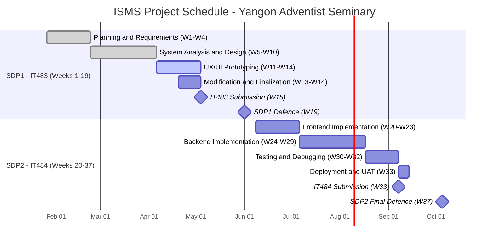

| SDP Weeks | Phase | Activity | Milestone |
|---|---|---|---|
| Weeks 1–4 | Proposal | Requirements gathering, stakeholder meetings, proposal writing and finalization. | Submit Proposal Draft — Week 4 |
| Weeks 5–14 | IT483 Execution | System analysis, ERD, DFD, use case diagrams, wireframes, user requirements. | — |
| Week 15 | IT483 Submission | Submit IT483 deliverables to evaluation committee. | IT483 Submission — Week 15 |
| Weeks 16–19 | IT483 Defence | Report revision; prepare and deliver IT483 defence. | IT483 Defence — Week 19 |
| Weeks 20–32 | IT484 Execution | Full implementation of all 8 modules, integration testing, UAT with YASIS stakeholders. | — |
| Week 33 | IT484 Submission | Submit IT484 deliverables (Report, Source Code, Manuals). | IT484 Submission — Week 33 |
| Weeks 34–37 | IT484 Defence | Final report, documentation, final defence. | IT484 Final Defence — Week 37 |

#### 3.10.2 Preliminary Software Cost Estimation
The following is a preliminary cost estimate provided to the YASIS administration as part of the project request process. Because the project is delivered as an academic senior project using exclusively open-source technologies, the cost to the institution is limited to optional hosting and domain expenses.

| Cost Category | Item | Estimated Cost |
|---|---|---|
| **Development** | Developer time (proponent — senior project, no salary) | USD 0 (in-kind, academic project) |
| **Software Licenses** | Laravel, MySQL, PHP — all open-source | USD 0 |
| **Hosting** | Cloud VPS (DigitalOcean Droplet, 2 GB RAM) | ~USD 12 / month (~USD 144 / year) |
| **Domain Name** | `.education` or `.com` domain registration | ~USD 10–15 / year |
| **SSL Certificate** | Let's Encrypt (free) | USD 0 |
| **Total Year 1 Cost to YASIS** | | **~USD 154–159 / year** |
| **Ongoing Annual Cost (Year 2+)** | Hosting + domain renewal | ~USD 154–159 / year |

> This estimate was shared with the Principal and the Treasurer during the January 2026 proposal review meeting, and the administration confirmed that the cost is within the school's operational budget. The addition of the HR module does not change the hosting footprint or the cost estimate.

---

### 3.11 Feasibility Study
This section evaluates the feasibility of the proposed ISMS across five dimensions — technical, legal, operational, schedule, and financial. Each dimension concludes with an explicit verdict, and the section closes with a consolidated feasibility decision (Section 3.11.6). The schedule dimension is supported by a quantitative Use Case Points (UCP) estimation, re-derived in v1.4 to reflect the ninth role and the HR/leave/absence use cases.

#### 3.11.1 Technical Feasibility
The project is technically feasible. The proponent has working proficiency in the Laravel (PHP) framework, MySQL, and general web-application development, which together constitute the full technology stack required by this project. All proposed technologies — Laravel, MySQL, PHP, the Spatie Laravel Permission package for RBAC, and standard libraries for PDF generation (e.g., DomPDF) and spreadsheet export (e.g., Laravel Excel) — are open-source, actively maintained, and well-documented. The proposed layered, web-based architecture is a standard and well-understood pattern for Management Information Systems, and none of the in-scope modules — including the new HR module — require specialized hardware, proprietary services, or research-grade techniques. The HR module reuses the same CRUD, RBAC, and audit patterns already established for the academic modules, so it adds breadth rather than technical novelty.

**Infrastructure adequacy.** The non-functional targets in Section 3.6 were checked against the proposed deployment infrastructure. A 2 GB-RAM cloud VPS (DigitalOcean Droplet) running a standard Laravel + MySQL stack comfortably serves the stated load of 100 concurrent users against a dataset of ~5,000 student records and five years of history, because the workload is read-dominant and low in write volume; staff records (tens to low hundreds of rows) add negligible load. The 3-second query and 5-second report-generation targets are achievable on this tier with conventional indexing and query caching. Should peak load at grade-release time exceed expectations, the architecture supports straightforward vertical scaling (resizing the droplet) and the addition of a caching layer without redesign, preserving the availability target of 99.9% during school hours.

**Primary technical risk and mitigation.** The principal technical risk is the single-developer constraint, which concentrates all implementation knowledge in one person. This is mitigated by deliberately selecting a mainstream, heavily documented stack and conventional design patterns, so that community resources and reference implementations are readily available, and by the explicit exclusion of biometric hardware, native mobile applications, payroll, and any accounting-system integration (deferred to Section 6, Future Enhancements), which removes the highest-uncertainty work from scope.

**Verdict:** *Technically feasible.*

#### 3.11.2 Legal Feasibility
Myanmar does not currently have a formally enacted personal data protection law. Nevertheless, the proponent acknowledges the legal and ethical obligation to handle student, guardian, and staff personal data responsibly. The ISMS will therefore be designed in alignment with Thailand's Personal Data Protection Act (PDPA, B.E. 2562, 2019) and the European Union's General Data Protection Regulation (GDPR, 2018) as compliance models, applying principles such as purpose-limited data collection, data minimization through role-based access restriction, and the right to rectification. Because student data concerns minors, parental/guardian consent at enrollment and a defined data-retention period (aligned to the institution's records policy) will be incorporated into the data-handling design. Staff personnel and leave data are similarly access-restricted to the HR Office and relevant approvers. Should Myanmar enact equivalent legislation in the future, the system architecture is designed to facilitate compliance without a major redesign. No paid licences are required, as all core technologies are open-source, eliminating any software-licensing legal exposure.

**Verdict:** *Legally feasible*, subject to incorporating guardian consent and a data-retention policy into the detailed design.

#### 3.11.3 Operational Feasibility
The system is operationally feasible. The school administration formally requested the system (Section 3.4) and has expressed strong motivation for its adoption, which is a key predictor of successful deployment. The ISMS is designed with simplicity and intuitiveness as core UI principles, and the role-based portals ensure that each user is presented only with the functions relevant to their position, minimizing the learning curve. Because the system automates existing manual processes rather than introducing entirely new workflows — including the HR office's existing staff-record and leave paperwork — the operational change for staff is incremental rather than disruptive.

**Data migration.** The principal operational consideration is the one-time onboarding of the institution's existing records — approximately 900 current student records and the staff roster (Section 3.6) presently held in paper registers and isolated Excel files. A CSV bulk-import utility will be provided, and the import will run during the UAT phase. The main risk is the inconsistent quality of legacy paper records; this is mitigated by a validation-on-import step that rejects malformed rows and by a reconciliation review conducted jointly with the Registrar and HR Office before go-live.

**Change management.** Training sessions are planned for all nine user roles prior to go-live, and the mobile-responsive design allows guardians and students to access the system from smartphones without installing any application, lowering the adoption barrier for the largest user group (parents).

**Verdict:** *Operationally feasible*, contingent on a planned data-migration and training effort during UAT.

#### 3.11.4 Schedule Feasibility (UCP-Based Estimation)
To objectively size the system, a Use Case Points (UCP) estimation was performed following the method of Karner (1993). For estimation purposes the 72 granular use cases listed in Section 3.6 are consolidated into **32 functional use cases** aligned with the system's modules; this avoids inflating the estimate through CRUD decomposition while preserving the true functional scope. Relative to v1.3, the estimate grows to reflect the ninth actor (HR Office) and twelve new functional use cases (Manage Staff Records, Record Staff Attendance, Leave Management, Guardian Absence Notice, Admin Credential Management, Data-Retention/Erasure, Principal Governance Controls, Announcements Publishing, Student Exit & Certificates, Section & Homeroom Management, Gradebook Setup, and Import Batch Management & Reconciliation).

**Step 1 — Unadjusted Actor Weight (UAW)**

All nine system actors are human users interacting through a graphical user interface and are therefore classified as *complex* actors (weight 3).

| Actor Type | Weight | Count | Subtotal |
|---|---|---|---|
| Complex (human actor via GUI) | 3 | 9 | 27 |
| **UAW** | | | **27** |

**Step 2 — Unadjusted Use Case Weight (UUCW)**

Use cases are classified by the number of transactions they contain: simple (≤3 transactions, weight 5), average (4–7, weight 10), and complex (>7, weight 15).

| Complexity | Weight | Count | Subtotal |
|---|---|---|---|
| Simple (audit-log viewing, guardian linking, roster/timetable view, student portal) | 5 | 4 | 20 |
| Average (user & role management, academic config, enrollment, transcript, fee-record import, fee reporting & download, Treasurer oversight, VP academic oversight, guardian portal, authentication/RBAC, **manage staff records**, **record staff attendance**, **admin credential management**, **data-retention / erasure**, **principal governance controls**, **announcements publishing**, **student exit & certificates**, **section & homeroom management**, **gradebook setup**, **import batch management & reconciliation**) | 10 | 20 | 200 |
| Complex (student registration, bulk promotion, attendance with notification, grade entry with GPA calc, school-wide dashboard analytics, Principal two-key approval workflow, **leave-management workflow**, **guardian absence-notice workflow**) | 15 | 8 | 120 |
| **UUCW** | | **32** | **340** |

**Step 3 — Unadjusted Use Case Points (UUCP)**

UUCP = UAW + UUCW = 27 + 340 = **367**

**Step 4 — Technical Complexity Factor (TCF)**

| Factor | Description | Weight | Value (0–5) | Extended |
|---|---|---|---|---|
| T1 | Distributed system | 2.0 | 1 | 2.0 |
| T2 | Response/performance objectives | 1.0 | 4 | 4.0 |
| T3 | End-user efficiency | 1.0 | 4 | 4.0 |
| T4 | Complex internal processing | 1.0 | 3 | 3.0 |
| T5 | Reusable code | 1.0 | 3 | 3.0 |
| T6 | Easy to install | 0.5 | 3 | 1.5 |
| T7 | Easy to use | 0.5 | 5 | 2.5 |
| T8 | Portable | 2.0 | 3 | 6.0 |
| T9 | Easy to change | 1.0 | 3 | 3.0 |
| T10 | Concurrent use | 1.0 | 4 | 4.0 |
| T11 | Security features | 1.0 | 5 | 5.0 |
| T12 | Third-party access | 1.0 | 1 | 1.0 |
| T13 | Special training | 1.0 | 2 | 2.0 |
| **TFactor** | | | | **41.0** |

TCF = 0.6 + (0.01 × TFactor) = 0.6 + (0.01 × 41.0) = **1.01**

**Step 5 — Environmental Complexity Factor (ECF)**

| Factor | Description | Weight | Value (0–5) | Extended |
|---|---|---|---|---|
| E1 | Familiarity with development process | 1.5 | 3 | 4.5 |
| E2 | Application experience | 0.5 | 2 | 1.0 |
| E3 | Object-oriented experience | 1.0 | 3 | 3.0 |
| E4 | Lead analyst capability | 0.5 | 3 | 1.5 |
| E5 | Motivation | 1.0 | 5 | 5.0 |
| E6 | Stable requirements | 2.0 | 4 | 8.0 |
| E7 | Part-time staff | -1.0 | 3 | -3.0 |
| E8 | Difficult programming language | -1.0 | 2 | -2.0 |
| **EFactor** | | | | **18.0** |

ECF = 1.4 + (-0.03 × EFactor) = 1.4 + (-0.03 × 18.0) = **0.86**

**Step 6 — Use Case Points (UCP)**

UCP = UUCP × TCF × ECF = 367 × 1.01 × 0.86 ≈ **318.8**

**Step 7 — Productivity Factor (PF) derivation**

Following the Schneider & Winters (1998) heuristic, the productivity factor is derived from the environmental factors: count the E1–E6 factors rated below 3 and the E7–E8 factors rated above 3.

| Condition | Factors satisfying it | Count |
|---|---|---|
| E1–E6 rated **below 3** | E2 (=2) | 1 |
| E7–E8 rated **above 3** | none | 0 |
| **Total** | | **1** |

A combined total of **1** (≤ 2) corresponds to a productivity factor of **20 hours per UCP**, the nominal rate for a low-risk environmental profile, driven primarily by stable requirements (E6) and high motivation (E5).

**Step 8 — Nominal Effort Estimation**

| Metric | Formula | Calculation | Value |
|---|---|---|---|
| Effort (hours) | UCP × PF | 318.8 × 20 | **≈ 6,376 hrs** |
| Effort (person-months) | Effort ÷ 160 | 6,376 ÷ 160 | **≈ 39.9 PM** |

**Step 9 — Interpretation and Reconciliation with the Academic Schedule**

The figure of approximately 40 person-months must be interpreted correctly. UCP is calibrated against *from-scratch, full-lifecycle professional development* and is well documented in the estimation literature to **overestimate** small, framework-based CRUD applications, because it gives no credit for the large body of reusable infrastructure such systems inherit. It is therefore used here in its most reliable role — as a **size-and-complexity benchmark** — rather than as a literal calendar predictor. At ≈319 UCP (up from ≈203 in v1.3), the result confirms that the ISMS — now spanning the HR module, the full administration surface, the Principal governance/communication tools, the complete Registrar records-and-certificates lifecycle, the teacher gradebook-setup workflow, and the treasurer import-reconciliation workflow — is a substantial, non-trivial system that comfortably clears the FIT minimum-complexity threshold (BIT 2019-05).

The *binding* schedule constraint is the fixed FIT academic calendar (Weeks 1–37). Feasibility within that calendar is established and protected by three levers:

1. **Framework reuse.** The ISMS is a read-dominant CRUD MIS built on Laravel, which supplies authentication scaffolding, the Spatie RBAC package, the Eloquent ORM, Blade templating, and mature PDF/spreadsheet libraries. The HR module in particular reuses the exact CRUD, RBAC, and audit patterns already built for the academic modules, so its marginal effort is small.
2. **Two-semester decomposition.** SDP1 (IT483, Weeks 1–19) front-loads planning, analysis, and design, so that SDP2 (IT484, Weeks 20–37) is pure, well-specified implementation against a frozen design.
3. **Scope discipline.** The explicit Out-of-Scope list in Section 3.6 fixes the boundary and is the primary contingency lever: should progress lag, lower-priority items (e.g., additional HR features beyond the confirmed three) are deferred rather than allowing scope to expand into the schedule.

**Verdict:** *Schedule-feasible* within the two-semester FIT structure, with scope deferral as the standing contingency.

#### 3.11.5 Financial Feasibility
The project is financially feasible. As established in Section 3.10.2, development is carried out as an academic senior project, so no developer salary or labour cost is incurred, and all development tools and frameworks are open-source or institution-provided. The only recurring cost to the institution is optional cloud hosting and domain registration, estimated at approximately **USD 154–159 per year**, which the administration confirmed to be within the school's operational budget. The HR module adds functionality without adding cost. Weighed against the benefits identified in Section 3.7 — reduced administrative and HR workload, improved data accuracy, faster reporting, and enhanced guardian communication — the modest, fixed annual cost represents a strongly favourable cost–benefit position.

**Verdict:** *Financially feasible* and sustainable.

#### 3.11.6 Consolidated Feasibility Decision

| Dimension | Verdict | Key Justification |
|---|---|---|
| **Technical** | Feasible | Proven open-source stack; proposed VPS meets the 100-user / 5,000-record load; HR module reuses established patterns; single-developer risk mitigated by mainstream technologies. |
| **Legal** | Feasible (conditional) | GDPR/PDPA-aligned design; requires guardian consent and a data-retention policy in detailed design. |
| **Operational** | Feasible (conditional) | Strong administration sponsorship; requires a planned data migration of ~900 student records plus the staff roster, and role-based training during UAT. |
| **Schedule** | Feasible | ≈319 UCP confirms substantial scope; delivered within Weeks 1–37 via framework reuse, two-semester decomposition, and scope discipline. |
| **Financial** | Feasible | Zero licensing/development cost; ~USD 154–159/year operational cost confirmed within budget. |

**Overall, the proposed ISMS is assessed as feasible for development and deployment at Yangon Adventist Seminary, with the conditional items above to be addressed during the IT483 detailed design and the UAT phase.**

---

## 4. Analysis and Design

### 4.1 Introduction
This section translates the requirements established in the Preliminary Investigation (Section 3) into a concrete technical design for the Integrated School Management System. It presents the project risk analysis, the overall system architecture, and the core analysis-and-design artifacts: the Use Case Diagram, the Entity Relationship Diagram (ERD) and its supporting Data Dictionary, the Class Diagram, representative Sequence and Swimlane (activity) Diagrams for the system's most critical workflows, the Component Diagram, and the wireframe documentation. Together these artifacts define *what* the system does, *how* its data is structured, and *how* its parts collaborate at run-time, forming the blueprint that will be implemented in System Development II (IT484).

The design follows the **Model–View–Controller (MVC)** pattern provided by the Laravel framework, augmented with a dedicated **Service (business-logic) layer** so that complex operations — fee-record import, GPA calculation, attendance notification, leave workflow, and absence-notice handling — are kept out of the controllers and remain individually testable. Access to every action is mediated by **Role-Based Access Control (RBAC)**, and every state-changing action is written to an immutable **audit log** to satisfy the non-repudiation requirement defined in Section 3.8.

### 4.2 Risk Analysis
Risks were identified across technical, operational, schedule, and data dimensions. Each is rated for likelihood and impact (Low / Medium / High) and paired with a concrete mitigation. The exposure score (Likelihood × Impact) is used to prioritise attention.

#### 4.2.1 Risks Table

| # | Risk | Likelihood | Impact | Exposure | Mitigation |
|---|---|---|---|---|---|
| R1 | **Legacy data migration quality** — ~900 existing student records (and the staff roster) in paper/Excel form are inconsistent or incomplete. | High | High | **High** | Validation-on-import (reject malformed rows); reconciliation review with the Registrar and HR Office before go-live; staged import during UAT. |
| R2 | **Single-developer dependency** — all implementation knowledge held by one proponent. | Medium | High | **High** | Mainstream, well-documented stack; version control with frequent commits; thorough inline and external documentation. |
| R3 | **Scope creep** — stakeholders request features beyond the agreed scope (e.g., HR features beyond the confirmed three, or payroll). | Medium | Medium | Medium | Explicit Out-of-Scope list (Section 3.6) treated as the change-control baseline; new requests deferred to a future phase. |
| R4 | **Data security / privacy breach** — exposure of student, guardian, or staff personal data (including sensitive absence reasons and leave data). | Low | High | Medium | RBAC, bcrypt password hashing, TLS in transit, AES-256 at rest for sensitive fields, server-side validation, audit logging, data-minimised routing of absence reasons to the homeroom teacher only. |
| R5 | **Low user adoption** — staff revert to manual processes. | Low | High | Medium | Role-based training before go-live for all nine roles; intuitive, role-scoped UI; administration sponsorship (Section 3.4). |
| R6 | **Schedule slippage** — implementation runs past the FIT calendar. | Medium | Medium | Medium | Two-semester decomposition; scope deferral as the standing contingency; framework reuse (the HR module reuses established CRUD/RBAC/audit patterns). |
| R7 | **Hosting / connectivity outage** — VPS downtime or loss of internet at school. | Low | Medium | Low | Reputable VPS provider; automated daily database backups; documented restore procedure. |
| R8 | **Incorrect import linkage** — imported fee records attached to the wrong student because accounting IDs differ from ISMS IDs. | Medium | High | **High** | Agreed matching key (ISMS student ID column in the export); validation-on-import that rejects unmatched rows; reconciliation review before records are made visible. |
| R9 | **Workflow integrity** — a leave request edited after a decision, an absence notice altered after its dates have passed, or a promotion approved by only one key, could corrupt the audit trail. | Low | Medium | Medium | Leave edits/cancellation permitted only while *Pending* and locked after a decision; absence notices editable/cancellable only while *upcoming*; cancellation stored as a status change, never a hard delete; two-key promotion enforces both VP and Principal keys. |

### 4.3 System Architecture
The ISMS adopts a classic three-tier, layered web architecture. The **Client Tier** is any modern browser rendering the mobile-responsive interface. The **Application Tier** is a Laravel application in which every request passes through routing and authentication/RBAC middleware before reaching a controller; controllers delegate all business logic to the Service layer, which in turn persists data through the Eloquent ORM. Two cross-cutting services — the Audit Log writer and the Notification service — are invoked by the Service layer rather than by individual controllers, ensuring they run consistently for every relevant action. The **Data Tier** is a single MySQL database. The only external dependency is an email/SMTP gateway used for guardian absence notifications and HR/security alerts.

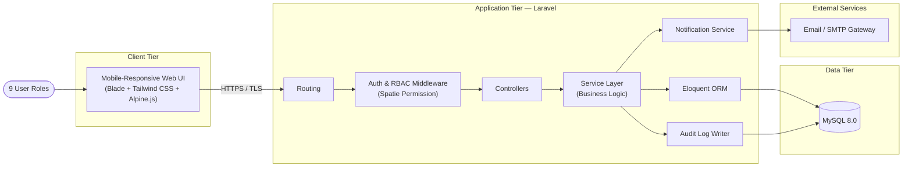

### 4.4 Use Case Diagram
The Use Case Diagram below summarises the principal interactions between the **nine** system actors and the ISMS. To remain legible, related CRUD operations are presented as consolidated functional use cases (the full granular list of 55 use cases appears in Section 3.6). Authentication is shown as a baseline use case that every actor performs. Three dependencies capture the new v1.4 workflows: a teacher's leave request is submitted to HR's leave management, a guardian's absence notice is reviewed by the homeroom teacher, and an approved review extends attendance recording (pre-marking *Excused*).

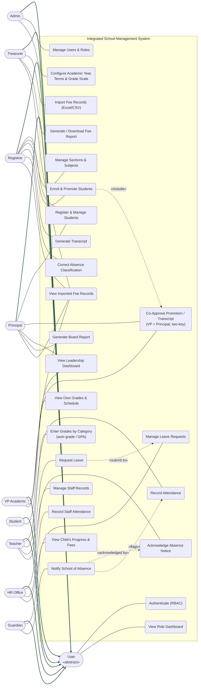

#### 4.4.1 Use Case Diagram Overview
All nine roles are modelled as specialisations of a base User actor (solid generalization arrows), so the behaviours every role shares — authenticating under RBAC and viewing a role-specific dashboard — are drawn once and inherited. Each actor is then joined by a plain association line only to the use cases its role permits, and RBAC enforces exactly this partition at run-time: a Teacher cannot reach financial or HR use cases, HR cannot reach grades, and a Guardian sees only its own children.

Four dependencies capture the important business rules. Promoting a student includes leadership sign-off (UC7 → UC13): the two-key co-approval in which the VP Academic reviews and the Principal co-approves mirrors the school's committee-decided promotion. A teacher's leave request is submitted into HR's leave management (UCT1 → UCH3). A guardian's absence notice is a **notification**, not a request: it is acknowledged by the child's homeroom teacher (UCG1 → UCR1) and flags the affected days on the roster (UCG1 → UC9), so that when the teacher records attendance those days default to *Excused*. The Registrar may correct a classification (UCR2). There is no "approve/decline" step — the school records the absence, it does not grant it. The finance use cases reflect the confirmed record-keeping model: the Treasurer imports fee records and produces reports, while the Principal, VP Academic, and Registrar hold read-only visibility (UCF). The HR Office owns the three HR use cases; the Principal additionally assists student registration and owns whole-school dashboards and Board reporting.

### 4.5 Entity Relationship Diagram (ERD)
The ERD models the persistent data structure of the ISMS, normalised to third normal form (3NF). The `USERS` table is the single authentication root, specialised into `STAFF_PROFILES`, `GUARDIANS`, and (optionally) `STUDENTS` portal accounts. Relative to v1.3, v1.4 adds the **HR entities** (`LEAVE_TYPES`, `LEAVE_REQUESTS`, `LEAVE_BALANCES`, `STAFF_ATTENDANCE`) and the **absence-notice entity** (`ABSENCE_NOTICES`), and extends `ATTENDANCE_RECORDS` with an `Excused` status and a nullable link to the absence notice that produced it.

```mermaid
erDiagram
    USERS ||--o| STAFF_PROFILES : "specialises to"
    USERS ||--o| GUARDIANS : "specialises to"
    USERS ||--o| STUDENTS : "portal account"
    STUDENTS ||--o{ STUDENT_GUARDIAN : "linked via"
    GUARDIANS ||--o{ STUDENT_GUARDIAN : "linked via"

    DEPARTMENTS ||--o{ STAFF_PROFILES : "employs"
    DEPARTMENTS ||--o{ SECTIONS : "groups"
    DEPARTMENTS ||--o{ SUBJECTS : "owns"
    DEPARTMENTS ||--o{ GRADE_SCALE_BANDS : "defines scale"
    ACADEMIC_YEARS ||--o{ TERMS : "divided into"
    ACADEMIC_YEARS ||--o{ SECTIONS : "scopes"
    STAFF_PROFILES ||--o{ SECTIONS : "homerooms"

    SECTIONS ||--o{ ENROLLMENTS : "has"
    STUDENTS ||--o{ ENROLLMENTS : "enrolled via"
    SECTIONS ||--o{ TEACHING_ASSIGNMENTS : "scheduled"
    SUBJECTS ||--o{ TEACHING_ASSIGNMENTS : "taught in"
    STAFF_PROFILES ||--o{ TEACHING_ASSIGNMENTS : "teaches"

    TERMS ||--o{ ATTENDANCE_RECORDS : "within"
    SECTIONS ||--o{ ATTENDANCE_RECORDS : "for"
    STUDENTS ||--o{ ATTENDANCE_RECORDS : "marked"

    SECTIONS ||--o{ ASSESSMENT_CATEGORIES : "graded in"
    SUBJECTS ||--o{ ASSESSMENT_CATEGORIES : "for"
    TERMS ||--o{ ASSESSMENT_CATEGORIES : "within"
    ASSESSMENT_CATEGORIES ||--o{ ASSESSMENTS : "groups"
    ASSESSMENTS ||--o{ GRADES : "scored in"
    STUDENTS ||--o{ GRADES : "receives"

    STAFF_PROFILES ||--o{ IMPORT_BATCHES : "uploads"
    IMPORT_BATCHES ||--o{ IMPORTED_FEE_RECORDS : "contains"
    STUDENTS ||--o{ IMPORTED_FEE_RECORDS : "billed in"

    STAFF_PROFILES ||--o{ STAFF_ATTENDANCE : "marked"
    STAFF_PROFILES ||--o{ LEAVE_REQUESTS : "submits"
    STAFF_PROFILES ||--o{ LEAVE_BALANCES : "holds"
    LEAVE_TYPES ||--o{ LEAVE_REQUESTS : "categorises"
    LEAVE_TYPES ||--o{ LEAVE_BALANCES : "for"
    LEAVE_REQUESTS ||--o{ STAFF_ATTENDANCE : "generates On-Leave"

    GUARDIANS ||--o{ ABSENCE_NOTICES : "submits"
    STUDENTS ||--o{ ABSENCE_NOTICES : "concerns"
    STAFF_PROFILES ||--o{ ABSENCE_NOTICES : "acknowledges"
    ABSENCE_NOTICES ||--o{ ATTENDANCE_RECORDS : "flags as Excused"

    USERS ||--o{ AUDIT_LOGS : "performs"

    USERS {
        bigint id PK
        string name
        string email UK
        string password
        enum status
    }
    STAFF_PROFILES {
        bigint id PK "FK to users.id"
        string staff_id_number UK
        enum role_type
        bigint department_id FK
        enum status
        date joined_date
        string phone
    }
    GUARDIANS {
        bigint id PK
        bigint user_id FK
        string relationship
        string phone
    }
    STUDENTS {
        bigint id PK
        bigint user_id FK
        string student_id_number UK
        bigint department_id FK
        enum enrollment_status
    }
    STUDENT_GUARDIAN {
        bigint id PK
        bigint student_id FK
        bigint guardian_id FK
        boolean is_primary
    }
    DEPARTMENTS {
        bigint id PK
        string name UK
        string level
    }
    ACADEMIC_YEARS {
        bigint id PK
        string year_label UK
        boolean is_active
    }
    TERMS {
        bigint id PK
        bigint academic_year_id FK
        string name
        int sequence
        date start_date
        date end_date
    }
    SECTIONS {
        bigint id PK
        bigint academic_year_id FK
        bigint department_id FK
        string name
        bigint homeroom_teacher_id FK
    }
    SUBJECTS {
        bigint id PK
        string code UK
        string name
        bigint department_id FK
    }
    TEACHING_ASSIGNMENTS {
        bigint id PK
        bigint section_id FK
        bigint subject_id FK
        bigint teacher_id FK
    }
    ENROLLMENTS {
        bigint id PK
        bigint student_id FK
        bigint section_id FK
        enum status
    }
    GRADE_SCALE_BANDS {
        bigint id PK
        bigint department_id FK
        string letter
        decimal min_score
        decimal gpa_point
    }
    ATTENDANCE_RECORDS {
        bigint id PK
        bigint student_id FK
        bigint section_id FK
        bigint term_id FK
        date attendance_date
        enum status
        string remark
        bigint absence_notice_id FK
        bigint recorded_by FK
    }
    ASSESSMENT_CATEGORIES {
        bigint id PK
        bigint section_id FK
        bigint subject_id FK
        bigint term_id FK
        string name
        decimal weight_pct
    }
    ASSESSMENTS {
        bigint id PK
        bigint category_id FK
        string name
        decimal max_score
    }
    GRADES {
        bigint id PK
        bigint assessment_id FK
        bigint student_id FK
        decimal score
        bigint entered_by FK
    }
    IMPORT_BATCHES {
        bigint id PK
        bigint uploaded_by FK
        string period
        int row_count
        datetime uploaded_at
    }
    IMPORTED_FEE_RECORDS {
        bigint id PK
        bigint student_id FK
        bigint import_batch_id FK
        date txn_date
        decimal amount
        decimal balance
        enum status
        boolean is_restricted
    }
    LEAVE_TYPES {
        bigint id PK
        string name UK
        boolean is_paid
    }
    LEAVE_REQUESTS {
        bigint id PK
        bigint staff_id FK
        bigint leave_type_id FK
        date from_date
        date to_date
        int days
        enum status
        bigint submitted_by FK
        bigint decided_by FK
        datetime decided_at
    }
    LEAVE_BALANCES {
        bigint id PK
        bigint staff_id FK
        bigint leave_type_id FK
        int year
        int allocated
        int pending
        int used
    }
    STAFF_ATTENDANCE {
        bigint id PK
        bigint staff_id FK
        date attendance_date
        enum status
        string remark
        bigint leave_request_id FK
        bigint recorded_by FK
    }
    ABSENCE_NOTICES {
        bigint id PK
        bigint student_id FK
        bigint guardian_id FK
        date from_date
        date to_date
        string reason
        enum status
        bigint acknowledged_by FK
        datetime acknowledged_at
    }
    AUDIT_LOGS {
        bigint id PK
        bigint user_id FK
        string role
        string action
        string entity_type
        bigint entity_id
        datetime created_at
    }
```

#### 4.5.1 ERD Overview
The model is organised around six subject areas. **Identity** (`USERS`, `STAFF_PROFILES`, `GUARDIANS`, `STUDENTS`, `STUDENT_GUARDIAN`) governs who exists and who may log in. **Organisation & calendar** (`DEPARTMENTS`, `ACADEMIC_YEARS`, `TERMS`) defines the four departments and four nine-week terms that scope every academic record. **Academic structure** (`SECTIONS`, `SUBJECTS`, `TEACHING_ASSIGNMENTS`, `ENROLLMENTS`, `GRADE_SCALE_BANDS`) defines the yearly class organisation. **Academic records** (`ATTENDANCE_RECORDS`, `ASSESSMENT_CATEGORIES`, `ASSESSMENTS`, `GRADES`) capture day-to-day teaching data. **Finance** (`IMPORT_BATCHES`, `IMPORTED_FEE_RECORDS`) holds imported fee records. **Human resource & absence** (`LEAVE_TYPES`, `LEAVE_REQUESTS`, `LEAVE_BALANCES`, `STAFF_ATTENDANCE`, `ABSENCE_NOTICES`) — new in v1.4 — holds staff attendance, the leave workflow with balances, and guardian absence notices. `AUDIT_LOGS` cuts across all areas.

#### 4.5.2 Relationship Summary
- Each `USERS` row specialises into exactly one of `STAFF_PROFILES`, `GUARDIANS`, or a `STUDENTS` portal account.
- A student and a guardian form a many-to-many relationship resolved by `STUDENT_GUARDIAN`; `is_primary` flags the guardian who receives absence notifications first.
- `DEPARTMENTS` is the parent of staff, sections, subjects, and the grade scale. `ACADEMIC_YEARS` is divided into four `TERMS`; attendance and assessment categories are stamped with a `term_id`.
- `ENROLLMENTS` resolves student ↔ section; `TEACHING_ASSIGNMENTS` resolves teacher ↔ section ↔ subject. Grading is category-driven: an `ASSESSMENT_CATEGORY` groups many `ASSESSMENTS`, each yielding one `GRADE` per student.
- An `IMPORT_BATCH` contains many `IMPORTED_FEE_RECORDS`, each linked to a `STUDENT`; `is_restricted` hides SDA discounts/allowances from guardian/student views.
- **HR:** a `STAFF_PROFILE` submits many `LEAVE_REQUESTS` (each of one `LEAVE_TYPE`) and holds `LEAVE_BALANCES` per type per year; a second relationship (`decided_by`) records the HR reviewer. `STAFF_ATTENDANCE` records daily staff status, separate from student `ATTENDANCE_RECORDS`.
- **Absence notices:** a `GUARDIAN` submits an `ABSENCE_NOTICE` that *concerns* a `STUDENT`. It is a notification, not an approval: `acknowledged_by` records the homeroom teacher who saw it. The notice does not write attendance ahead of time; instead, when the homeroom teacher takes attendance on the day, the flagged `ATTENDANCE_RECORDS` are set to `Excused` and reference the notice (via `attendance_records.absence_notice_id`). The Registrar may correct that classification.

### 4.6 Data Dictionary
The Data Dictionary specifies the persistent entities defined in the ERD. Notation: **PK** primary key, **FK** foreign key, **UQ** unique, **NN** not null. Only entities that are new or changed in v1.4 are reproduced in full below; all other tables (`users`, `students`, `guardians`, `academic_years`, `sections`, `subjects`, `enrollments`, `grades`, `import_batches`, `imported_fee_records`, `audit_logs`, `departments`, `terms`, `grade_scale_bands`, `assessment_categories`, `assessments`) are unchanged from v1.3.

#### 4.6.1 staff_profiles *(changed)*
Staff-specific data; shares its key with `users`.

| Field | Type | Constraints | Description |
|---|---|---|---|
| id | BIGINT UNSIGNED | PK, FK→users.id, NN | Staff identifier. |
| staff_id_number | VARCHAR(30) | NN, UQ | Official staff ID. |
| role_type | ENUM('Admin','Principal','VP_Academic','Registrar','Teacher','Treasurer','HR_Office') | NN | Operational role for RBAC. **`HR_Office` added.** |
| department_id | BIGINT UNSIGNED | FK→departments.id, NULL | Department (for teachers / staff). |
| status | ENUM('Active','On Leave','Probation','Inactive') | NN, DEFAULT 'Active' | **Added.** Employment status; offboarding sets `Inactive`. |
| joined_date | DATE | NN | **Added.** Start date. |
| phone | VARCHAR(30) | NULL | **Added.** Contact number. |

#### 4.6.2 attendance_records *(changed)*
Daily student attendance per section.

| Field | Type | Constraints | Description |
|---|---|---|---|
| id | BIGINT UNSIGNED | PK, NN, AUTO_INC | Record identifier. |
| student_id | BIGINT UNSIGNED | FK→students.id, NN | Student marked. |
| section_id | BIGINT UNSIGNED | FK→sections.id, NN | Section context. |
| term_id | BIGINT UNSIGNED | FK→terms.id, NN | Term (for per-term rate reporting). |
| attendance_date | DATE | NN | Date of record. |
| status | ENUM('Present','Absent','Tardy','Excused') | NN | **`Excused` added** — set by the homeroom teacher when taking attendance, defaulting on days flagged by an absence notice. |
| remark | VARCHAR(150) | NULL | Free-text note. |
| absence_notice_id | BIGINT UNSIGNED | FK→absence_notices.id, NULL | **Added.** Set at attendance time; links an Excused day to the notice that flagged it. |
| recorded_by | BIGINT UNSIGNED | FK→staff_profiles.id, NN | Teacher who recorded it. |

> Composite uniqueness (`student_id`, `section_id`, `attendance_date`) prevents duplicate marks for the same day.

#### 4.6.3 leave_types *(new)*

| Field | Type | Constraints | Description |
|---|---|---|---|
| id | BIGINT UNSIGNED | PK, NN, AUTO_INC | Identifier. |
| name | VARCHAR(30) | NN, UQ | Annual / Sick / Unpaid. |
| is_paid | BOOLEAN | NN | Whether the leave is paid. |

#### 4.6.4 leave_requests *(new)*

| Field | Type | Constraints | Description |
|---|---|---|---|
| id | BIGINT UNSIGNED | PK, NN, AUTO_INC | Identifier. |
| staff_id | BIGINT UNSIGNED | FK→staff_profiles.id, NN | Requesting staff member. |
| leave_type_id | BIGINT UNSIGNED | FK→leave_types.id, NN | Type of leave. |
| from_date / to_date | DATE | NN | Leave period. |
| days | SMALLINT | NN | Working days requested. |
| reason | VARCHAR(255) | NULL | Stated reason. |
| status | ENUM('Pending','Approved','Rejected','Cancelled') | NN | Lifecycle status. |
| submitted_by | BIGINT UNSIGNED | FK→staff_profiles.id, NN | Who entered the request — the staff member (via the Teacher portal) or the HR Office **on behalf of** non-portal staff (receptionist, maintenance, canteen, etc.). |
| decided_by | BIGINT UNSIGNED | FK→staff_profiles.id, NULL | HR reviewer. |
| decided_at | DATETIME | NULL | Decision timestamp. |

> Editable/cancellable only while `status = 'Pending'`. `Cancelled` is a withdrawal, never a physical delete (non-repudiation). **Balance reservation:** on submission the requested `days` are added to `leave_balances.pending`; on approval they move from `pending` to `used`; on rejection/cancellation they are released from `pending`. A request is accepted only if `allocated − used − pending ≥ days`, which prevents overlapping Pending requests from over-spending a balance.

#### 4.6.5 leave_balances *(new)*

| Field | Type | Constraints | Description |
|---|---|---|---|
| id | BIGINT UNSIGNED | PK, NN, AUTO_INC | Identifier. |
| staff_id | BIGINT UNSIGNED | FK→staff_profiles.id, NN | Owner. |
| leave_type_id | BIGINT UNSIGNED | FK→leave_types.id, NN | Balance category. |
| year | SMALLINT | NN | Academic/calendar year. |
| allocated | SMALLINT | NN | Days granted for the year. |
| pending | SMALLINT | NN, DEFAULT 0 | Days reserved by requests that are still Pending (released on reject/cancel). |
| used | SMALLINT | NN | Days consumed by approved leave. |

> Composite uniqueness (`staff_id`, `leave_type_id`, `year`). Remaining balance = `allocated − used − pending`; a new request is validated against this figure so concurrent Pending requests cannot over-spend the allowance.

#### 4.6.6 staff_attendance *(new)*

| Field | Type | Constraints | Description |
|---|---|---|---|
| id | BIGINT UNSIGNED | PK, NN, AUTO_INC | Identifier. |
| staff_id | BIGINT UNSIGNED | FK→staff_profiles.id, NN | Staff member. |
| attendance_date | DATE | NN | Day of record. |
| status | ENUM('Present','Absent','Tardy','On-Leave') | NN | Daily status. |
| remark | VARCHAR(150) | NULL | Optional note. |
| leave_request_id | BIGINT UNSIGNED | FK→leave_requests.id, NULL | Set when an `On-Leave` day was generated from an approved leave request (the approved leave is the source of truth). |
| recorded_by | BIGINT UNSIGNED | FK→staff_profiles.id, NN | HR user who recorded it. |

> Composite uniqueness (`staff_id`, `attendance_date`). Distinct from the student `attendance_records` table. **Consistency rule:** approving a leave request auto-generates (or updates) the `On-Leave` `staff_attendance` rows for its dates and links them via `leave_request_id`, so the attendance sheet cannot silently disagree with approved leave; HR still records Present/Absent/Tardy manually for normal days.

#### 4.6.7 absence_notices *(new)*

| Field | Type | Constraints | Description |
|---|---|---|---|
| id | BIGINT UNSIGNED | PK, NN, AUTO_INC | Identifier. |
| student_id | BIGINT UNSIGNED | FK→students.id, NN | Child the notice concerns. |
| guardian_id | BIGINT UNSIGNED | FK→guardians.id, NN | Submitting guardian. |
| from_date / to_date | DATE | NN | Absence period. |
| reason | VARCHAR(255) | NULL | Stated reason (visible only to homeroom teacher & Registrar). |
| status | ENUM('Submitted','Acknowledged','Cancelled') | NN, DEFAULT 'Submitted' | Lifecycle status. A notification — never "approved" or "declined". |
| acknowledged_by | BIGINT UNSIGNED | FK→staff_profiles.id, NULL | Homeroom teacher who acknowledged the notice. |
| acknowledged_at | DATETIME | NULL | Acknowledgement timestamp. |

> The notice is **accepted on submission** and raised as a roster flag; it does **not** write attendance in advance. Editable/cancellable by the guardian only while *upcoming* (before its dates pass). The `Excused` classification is applied to each `attendance_records` row **when attendance is taken on the day**, at which point the row references this notice via `absence_notice_id`. `Cancelled` is a withdrawal, never a hard delete.

#### 4.6.8 audit_logs *(changed)*
Immutable non-repudiation trail. In v1.4 a `role` column is added so the log captures the role the actor held **at the time of the action**, which a later join to `staff_profiles.role_type` could not reconstruct if the user's role changes.

| Field | Type | Constraints | Description |
|---|---|---|---|
| id | BIGINT UNSIGNED | PK, NN, AUTO_INC | Log identifier. |
| user_id | BIGINT UNSIGNED | FK→users.id, NN | Actor. |
| role | VARCHAR(30) | NN | **Added.** Role held by the actor when the action occurred. |
| action | VARCHAR(255) | NN | Action performed. |
| entity_type | VARCHAR(80) | NN | Affected entity. |
| entity_id | BIGINT UNSIGNED | NULL | Affected record key. |
| created_at | DATETIME | NN | Immutable timestamp. |

### 4.7 Class Diagram
The Class Diagram expresses the design in three layers: **Controllers** (thin, one per module), **Services** (business logic), and **Models** (Eloquent entities mapped to the data dictionary). Cross-cutting `AuditService` and `NotificationService` are invoked by the domain services. v1.4 adds the HR and absence controllers, services, and models. Only representative attributes and methods are shown.

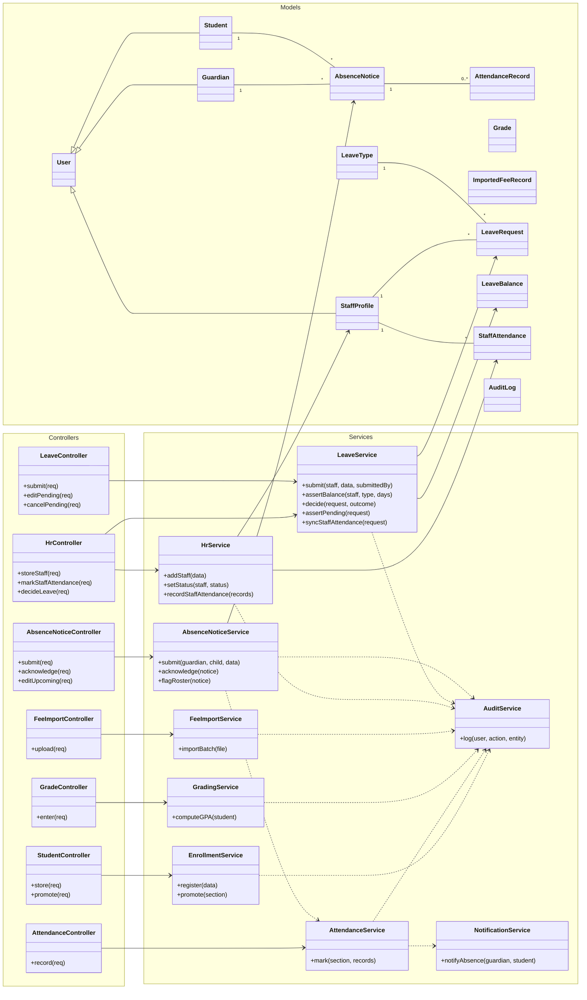

#### 4.7.1 Class Diagram Overview
Controllers remain thin and delegate to services, so business rules live in one testable place. The new dependencies enforce the v1.4 rules: `LeaveService.assertPending` guards edits/cancels so a decided request can never be mutated; `LeaveService.assertBalance` reserves days against `leave_balances.pending` so overlapping requests cannot over-spend an allowance; `LeaveService.syncStaffAttendance` generates the `On-Leave` staff-attendance rows on approval so the attendance sheet cannot drift from approved leave; and `AbsenceNoticeService.flagRoster` raises a roster flag, with the *Excused* mark set later by `AttendanceService` when the teacher takes attendance — not written ahead of the day. Every domain service depends on `AuditService`, keeping non-repudiation logging (including the actor's role at the time) uniform across the academic, finance, HR, and absence workflows alike.

### 4.8 Sequence Diagrams
The following sequence diagrams trace the system's most critical workflows, including the two new v1.4 cross-role flows.

**4.8.1 Record Attendance with Guardian Notification**

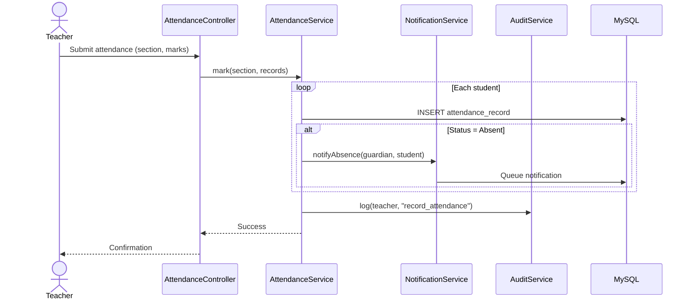

**4.8.2 Import Fee Records (Bulk Upload)**

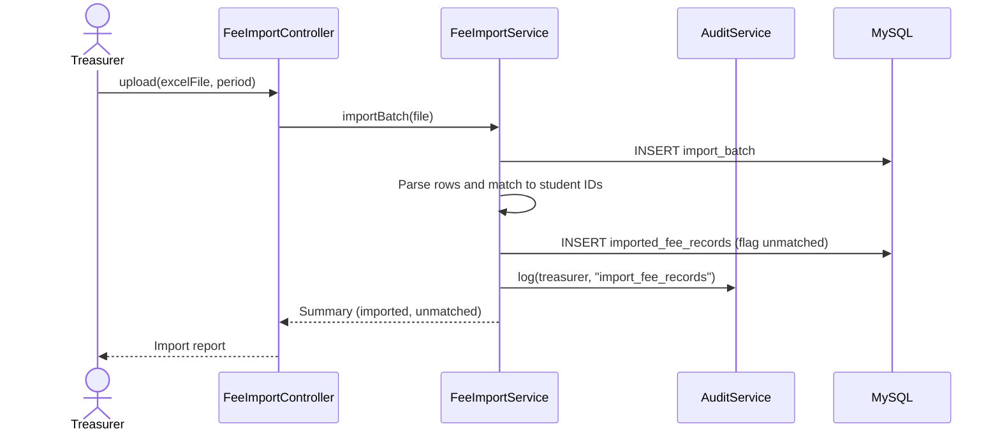

**4.8.3 Enter Grades with GPA Calculation**

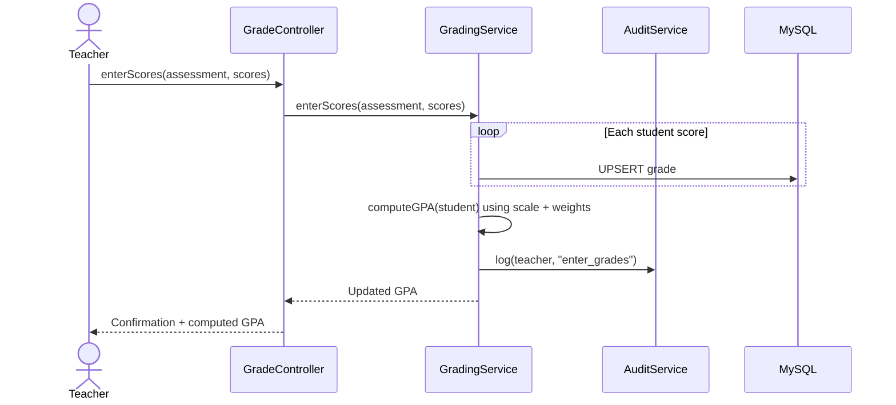

**4.8.4 Teacher Leave Request (new)**

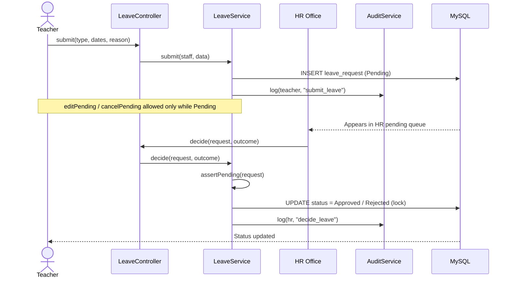

**4.8.5 Guardian Absence Notice (new)**

The notice is a **notification**, so it is accepted on submission and never "approved" or "declined". It raises a flag on the homeroom roster; the day is classified *Excused* only when the teacher actually takes attendance.

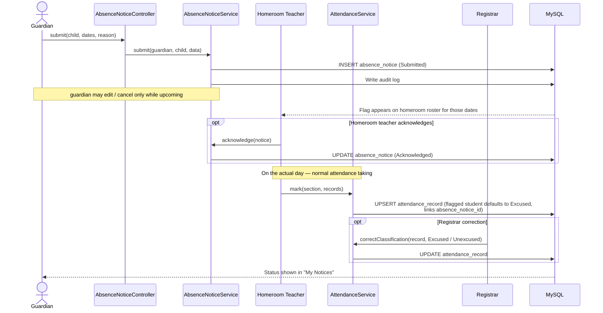

> **Why notify-not-approve.** A parent reporting that their child will be absent is not a request the school can grant or deny — the child is absent regardless. The homeroom teacher's real decision is only *how the day is marked* (Excused or not), and that is made once, at attendance time, by the single teacher who owns that roster. This keeps least-privilege intact (one owner, sensitive reason not broadcast) and avoids writing attendance for days that have not happened yet; the Registrar retains a correction path.

### 4.9 Swimlane Diagrams (Use Case Process Flows)
Swimlane (activity) diagrams show how a process moves across roles.

**4.9.1 Fee-Record Import and Visibility**

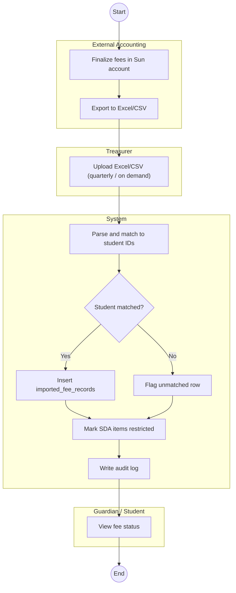

**4.9.2 Teacher Leave Request (new)**

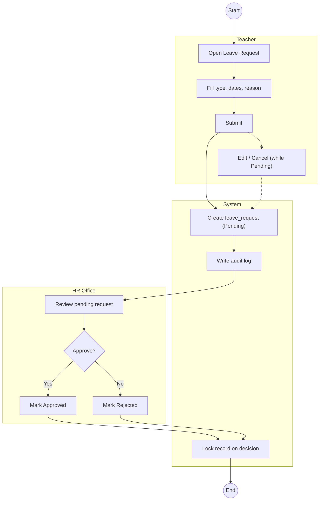

**4.9.3 Guardian Absence Notice — Notify, Acknowledge, Classify at Attendance (new)**

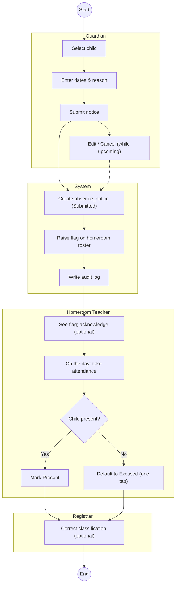

### 4.10 Component Diagram
The Component Diagram presents the system as deployable modules grouped into the three architectural tiers and communicating only through published interfaces (APIs). v1.4 adds the **HR Portal** and the **HR module** (with its Leave and Staff-Attendance APIs); the Guardian portal gains a write path for the absence notice.

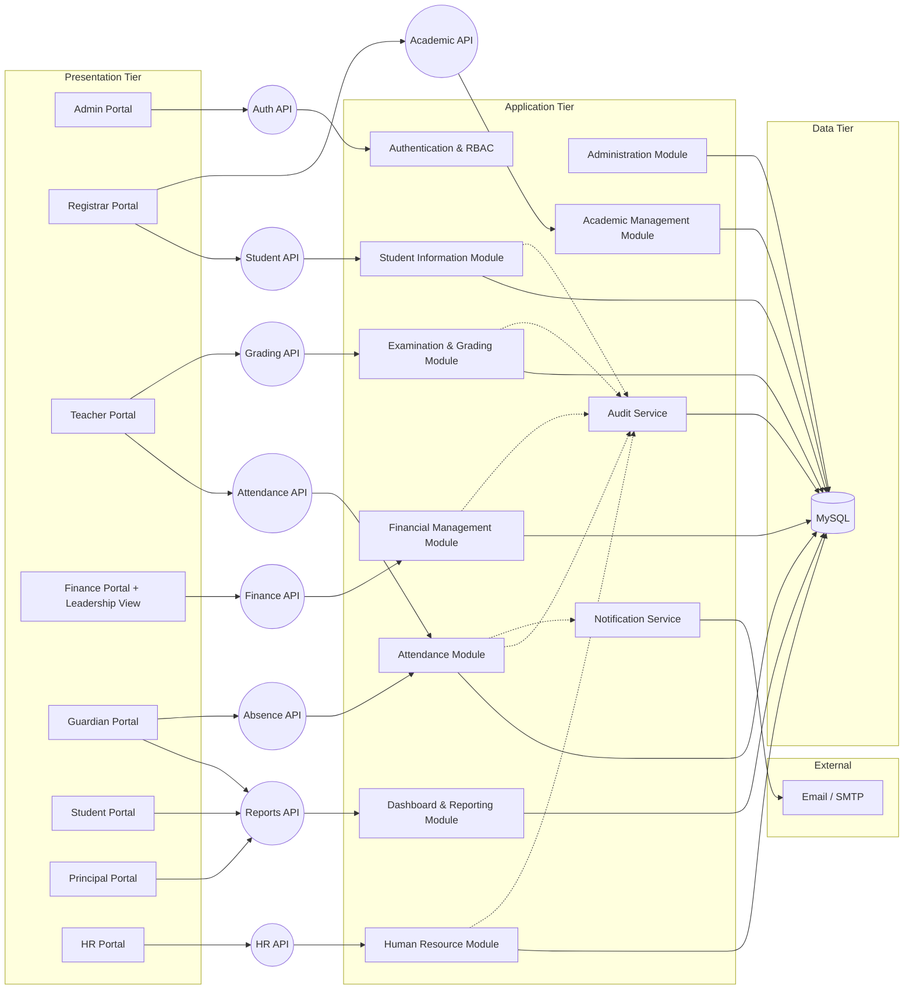

#### 4.10.1 Component Diagram Overview
The decomposition preserves loose coupling: each portal binds to published APIs, and the modules share nothing except the database and the cross-cutting services. The HR module is exposed only to the HR Portal; the absence-notice write path is exposed to the Guardian portal but routed through the Attendance module (which owns the *Excused* status), keeping ownership clean. The Financial Management module still only ingests imported records — never writing transactions — keeping the finance boundary (Section 3.6) intact.

### 4.11 Wireframe Documentation
High-fidelity wireframes for all **nine** role portals are produced in the UX/UI prototyping activity of IT483. Figma wireframes and clickable interactive HTML prototypes have been built for the Principal and HR portals and for the Teacher-leave and guardian-absence flows. The specifications below define the intent, key elements, and primary role for the system's principal screens.

| Screen | Primary Role(s) | Key Elements |
|---|---|---|
| **Login** | All | Email + password fields, per-role demo accounts, error messaging, password-reset link, TLS indicator. |
| **Admin Dashboard** | Admin | Active-user count, accounts-needing-attention tile (inactive / never-logged-in / reset requested), login-activity log, latest-backup status, academic-year banner, links to user & configuration management (incl. HR Portal link). |
| **User & Role Management** | Admin | Searchable user table, create/edit drawer, role selector (9 roles), activate/deactivate **and reactivate** toggle, **Reset password / Re-send login** action, **Action retention/erasure** control, audit-log link. |
| **Student Registration** | Registrar | Multi-section form (personal, academic, guardian linking), validation hints, save-and-enroll action. |
| **Sections & Homeroom** | Registrar | Create/edit sections per department-year, assign homeroom teacher, roster size, subject-teaching handoff to VP. |
| **Section & Enrollment** | Registrar | Section roster, enroll controls, guardian-link status, **prepare-promotion-batch** control (routes to VP + Principal co-approval). |
| **Student Exit & Certificates** | Registrar | Transfer/drop with **Transfer/Leaving Certificate**, graduation/exit (mark Graduated + completion certificate), **Enrollment (bonafide) certificate**, generated as printable PDFs. |
| **Attendance Entry** | Teacher | Date selector, section roster with Present/Absent/Tardy/Excused, submit, consecutive-absence flag, **guardian absence-notice flag with one-tap Excused default**. |
| **Gradebook Setup** | Teacher | Manage assessment categories with weights (must total 100%), create assessments per category, per section-subject-term. |
| **Grade Entry** | Teacher | Assessment selector, score grid per student, auto-computed grade/GPA preview, **homeroom report-card comment**, save action. |
| **Teacher Leave Request** *(new)* | Teacher | Leave-balance strip, submit form (type, dates, reason), "My requests" list with Edit/Cancel while Pending and locked-when-decided. |
| **Fee-Record Import** | Treasurer | Excel/CSV upload, import preview with matched/unmatched rows, validation messages. |
| **Import History & Reconciliation** | Treasurer | Batch list (who/when/rows/period), **revert a batch**, and **resolve unmatched rows** by mapping each to the correct student. |
| **Fee Reports & Charts** | Treasurer | Per-student and summary fee views, fee-status donut, outstanding-by-department bar, collection-rate trend, download/print (PDF). |
| **Leadership Finance View** | Principal / VP Academic / Registrar | Read-only imported fee status and outstanding balances; no editing. |
| **Principal Dashboard** *(new detail)* | Principal | Whole-school KPIs, enrollment by department, **read-only staff/HR summary (headcount, on-leave today, pending leave)**, **two-key approval queue**, registration-assist, read-only finance, Board reports, **Announcements composer**, **Governance Controls (promotion window, grade lock, transcript issuance, results release)**. |
| **HR Dashboard** *(new)* | HR Office | Staff-by-department headcount, active/on-leave today, staff attendance rate, pending leave requests. |
| **HR — Staff Records** *(new)* | HR Office | Searchable/filterable roster, add-staff form, per-staff profile with status change and offboarding. |
| **HR — Staff Attendance** *(new)* | HR Office | Daily staff roster with Present/Absent/Tardy/On-Leave, mark-all, submit. |
| **HR — Leave Management** *(new)* | HR Office | Pending/Approved/Rejected tabs, approve/reject, per-staff leave-balance table. |
| **Guardian Portal** | Guardian | Child selector, attendance rate, latest grades, current fee balance, notification feed. |
| **Guardian — Notify School of Absence** *(new)* | Guardian | Child selector, "the school will be notified; your homeroom teacher will see this" note, submit form, "My notices" history (Submitted / Acknowledged) with Edit/Cancel while upcoming. |
| **Student Portal** | Student | Current grades/GPA, attendance history, class schedule, upcoming assessments, downloadable report card. |

---

## 5. Conclusion and Strategic Recommendation

The proposed Integrated School Management System represents a strategic investment in Yangon Adventist Seminary's institutional infrastructure. By replacing manual, paper-based record-keeping — across academic, financial, **and human-resource** functions — with a centralized, role-based platform, the project will modernize administrative workflows and directly support the YASIS mission of cultivating young people for commitment to God, service to society, and citizenship in heaven.

The system is scoped to serve the real operational needs of the YASIS organizational hierarchy — from the Registrar managing student admissions, to Teachers recording daily attendance and requesting leave, to the HR Office maintaining staff records, attendance, and leave, to the Treasurer importing finalized fee records for transparent display, to the Principal overseeing the whole school through two-key approvals, to Guardians monitoring their child's progress and notifying the school of planned absences. Every module and every one of the nine user roles has a direct justification in the daily workflows of the institution, and the explicit finance and HR boundaries ensure the ISMS complements rather than disrupts the school's existing processes.

The preliminary investigation confirms that the project is technically, legally, operationally, schedule-, and financially feasible. The technology stack is proven and open-source, the cost to the institution is minimal, and the development effort — quantified at approximately 319 Use Case Points — is achievable within the two-semester FIT Senior Project structure through framework reuse and disciplined scope management.

> The proponent respectfully seeks approval from the administration to proceed with the development timeline, with the goal of delivering a fully operational ISMS — including the Human Resource module — by October 2026.

---

## 6. Future Enhancements

The scope defined in this report represents the first delivered version of the ISMS, targeted for completion in October 2026. The following capabilities are deliberately planned as post-delivery enhancements, documented here to show the system's intended growth path; the layered, modular architecture (Section 4) is designed so that each can be added later without redesigning the core platform.

- **HR Module — Further Iterations.** The delivered HR scope is Staff Records, Staff Attendance, and Leave Management. Subsequent iterations may add **payroll/salary processing**, contract and document management, and staff performance records, subject to confirmation with the school's HR office.

- **Future Sun Plus Financial Integration.** The school currently uses a Sun account, Microsoft Excel, and Word process rather than Sun Plus. If YASIS adopts Sun Plus in the future, this enhancement will allow finished fee records to be imported from Sun Plus (via Excel/CSV bulk upload). Consistent with the boundary in Section 3.6, the ISMS will remain a record-keeping and reporting layer and will never perform financial transactions.

- **Online Admissions Portal.** A public, mobile-responsive registration page through which prospective families can submit applications that arrive in the ISMS as pending applications for the Registrar to review and approve, with spam/bot protection and server-side validation.

- **Announcements — wider roles.** The **Principal** school-wide announcement composer (with audience targeting) is delivered in the first release (see the Principal use cases, Section 3.6). Extending the same announcement feature to **other authors** — for example teachers posting to their own class, or the Registrar posting notices — is planned as a follow-up so that every role that needs to communicate can, on a role-scoped basis.

- **Additional Notification Channels.** SMS, Viber, and Telegram delivery channels for absence and fee alerts, as configurable add-ons to the core email channel.

These enhancements would be scheduled in agreement with the school following the successful delivery and adoption of the first release.

---

## 7. References

- European Parliament. (2018). *General Data Protection Regulation (GDPR) — Regulation (EU) 2016/679.* Retrieved from https://gdpr-info.eu
- Fedena. (2024). *Fedena School Management Software Documentation.* Retrieved from https://fedena.com
- Karner, G. (1993). *Resource Estimation for Objectory Projects.* Objective Systems SF AB.
- Laravel LLC. (2025). *Laravel 12 Official Documentation.* Retrieved from https://laravel.com/docs/12.x
- Miller, R. B. (1968). Response time in man-computer conversational transactions. *Proceedings of the AFIPS Fall Joint Computer Conference,* 33, 267–277.
- Moodle Pty Ltd. (2024). *Moodle Learning Management System Documentation.* Retrieved from https://moodle.org
- MySQL AB. (2024). *MySQL 8.0 Reference Manual.* Oracle Corporation. Retrieved from https://dev.mysql.com/doc/refman/8.0/en/
- National Institute of Standards and Technology (NIST). (2024). *Non-repudiation.* NIST CSRC Glossary. Retrieved from https://csrc.nist.gov/glossary/term/non_repudiation
- NIST SP 800-53 Rev. 5. (2020). *Security and Privacy Controls for Information Systems and Organizations — AU-10: Non-Repudiation.* National Institute of Standards and Technology.
- Ministry of Digital Economy and Society, Thailand. (2019). *Personal Data Protection Act B.E. 2562 (2019).* Retrieved from https://www.mdes.go.th/law/detail/3577-Personal-Data-Protection-Act-B-E--2562--2019-
- OS4ED. (2024). *openSIS Community Edition — Open Source Student Information System.* Open Solutions for Education, Inc. Retrieved from https://www.os4ed.com
- Pressman, R. S., & Maxim, B. R. (2019). *Software Engineering: A Practitioner's Approach* (9th ed.). McGraw-Hill. [SEPA-9Ed]
- Schneider, G., & Winters, J. P. (1998). *Applying Use Cases: A Practical Guide.* Addison-Wesley.
- Shneiderman, B. (1984). Response time and display rate in human performance with computers. *ACM Computing Surveys,* 16(3), 265–285.
- Spatie. (2024). *Laravel Permission Package Documentation.* Retrieved from https://spatie.be/docs/laravel-permission

---

*ISMS IT483 Report | Yangon Adventist Seminary | Version 1.4 Defence Draft | July 3, 2026*
figma.com/design/sb8nkliPG7kbiaveKlJhpb/ISMS-wireframe.01?t=qPDjkuiulhbObYwW-0